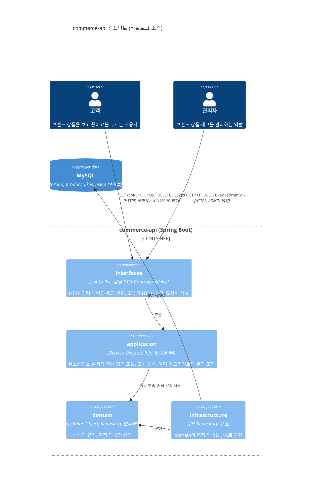
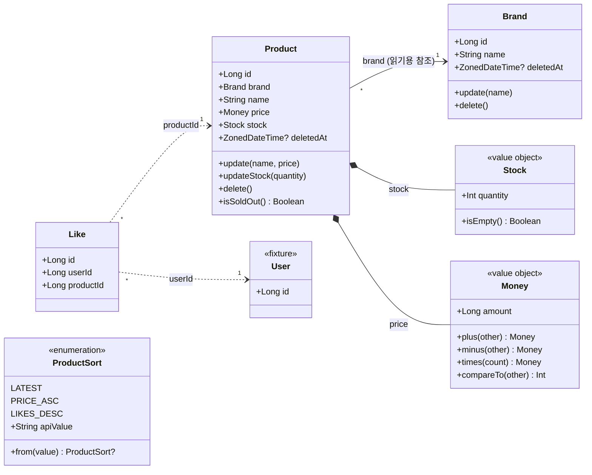
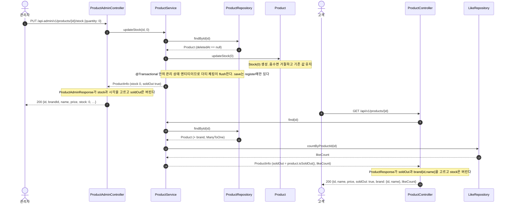

# 카탈로그 설계 — 브랜드, 상품, 좋아요

2주차 첫 번째 조각의 설계 문서다. 용어는 [`CONTEXT.md`](../../CONTEXT.md)를 따르고, 각 개념의 규칙·속성·행위는 [`docs/domain/catalog.md`](../domain/catalog.md)에 있다. 삭제 방식의 결정은 [ADR 0001](../adr/0001-soft-delete-catalog-hard-delete-like.md)이다.

범위: 고객의 브랜드 상세, 상품 목록·상세, 좋아요 누르기·취소·내 좋아요 목록. 관리자의 브랜드·상품 CRUD와 재고 변경. 포인트와 주문은 다음 조각이다.

## 1. 컴포넌트 다이어그램

과제의 "버드뷰"를 C4 컴포넌트 다이어그램으로 그린다. 고객과 관리자, API 서버 안의 네 계층, DB와 요청 방향을 담는다.

### 허용 의존 방향

`LayeredArchitectureTest`가 검사하는 규칙과 같다.

| 계층 | 맡는 일 | 의존해도 되는 것 | 의존하면 안 되는 것 |
| --- | --- | --- | --- |
| interfaces | 고객·관리자 입력과 응답, HTTP 오류 매핑, 요청자 식별 | application, domain | infrastructure |
| application | 유스케이스 순서, 교차 검사(브랜드 삭제 조건, 이름 중복, 브랜드 존재), 응답 모델 조합 | domain | interfaces, infrastructure |
| domain | 상태와 규칙, 저장 약속(repository 인터페이스) | 없음 | interfaces, application, infrastructure |
| infrastructure | repository 약속의 JPA 구현 | domain | interfaces, application |

패키지는 계층 아래 개념별로 둔다: `domain/brand`, `domain/product`, `domain/like`와 같은 이름을 application, infrastructure, `interfaces/api` 아래에도 둔다. API 버전은 클래스 이름이 아니라 `interfaces/api` 바로 아래 패키지에 붙인다(`interfaces/api/v1/brand/BrandController`, `BrandAdminController`). URL `/api/v1/...`과 패키지가 같은 모양이고, 학습용 저장소라 v1에서 끝나므로 버전 우선 배치가 개념 우선(`brand/v1`)보다 단순하다. 개념 사이 순환은 계층마다 따로 검사한다(5.16). interfaces의 슬라이스 규칙은 `api.v*` 세그먼트를 건너뛰고 그다음 세그먼트를 개념으로 잡는다. application의 유스케이스 컴포넌트는 `Service` 접미사를 쓰고 `Facade`는 쓰지 않는다(`BrandService`). 유스케이스 입력은 application에 `<개념><동사>Request`로 둔다(`ProductAdminRegisterRequest`, 5.17). domain 계층에는 `Service`를 붙인 클래스를 두지 않는다. 여러 개념이 함께 쓰는 값 객체(`Money`)는 `domain/shared`에 두고, 한 개념만 쓰는 값 객체(`Stock`)는 그 개념 패키지에 둔다(5.14). 이름은 값 객체가 아니라 `String`이며 엔티티가 검사한다(5.19). infrastructure는 개념마다 Spring Data 인터페이스 `<개념>JpaRepository`와 domain의 저장 약속을 구현하는 `@Component` `<개념>RepositoryImpl` 둘을 둔다(5.20).

### 요청자와 관리자 경계

- 고객 요청 중 좋아요 누르기·취소·내 목록은 API 게이트웨이가 넣어 준 `X-USER-ID` 헤더로 요청자를 식별한다. 브랜드·상품 조회는 요청자가 없어도 된다.
- 관리자 경계는 `/api-admin/**`에 ADMIN 역할을 요구한다. 이 경계는 통합 테스트에서만 존재한다. 과제가 제공하는 Spring Security 테스트 지원 설정(과제 원문 이름 `AdminBoundaryConfig`)을 `src/test`의 `@TestConfiguration` `com.loopers.config.security.AdminSecurityConfig`로 두고, 관리자 API를 부르는 테스트가 `@Import`로 명시해서 MockMvc의 `user().roles("ADMIN")`으로 실행한다. Spring Security 의존성도 test 범위에만 있으므로 운영 코드에는 인증이 없다. 관리자가 아니거나 식별이 없는 요청은 403이다(5.10).

## 2. 클래스 다이어그램

- 실선 `Product → Brand`는 JPA `@ManyToOne` 읽기 참조다. 애그리거트는 둘이며 저장소도 둘이다. 브랜드를 지울 수 있는지는 `Brand`가 아니라 application이 상품 저장소에 물어서 판단한다.
- 점선 `Like → Product`, `Like → User`는 식별자만 보관하는 관계다. 좋아요 수는 `Like`를 세어 구하고 `Product`에 저장하지 않는다.
- `deletedAt`은 `BaseEntity`에서 온다. `Like`는 `BaseEntity.delete()`를 쓰지 않고 행을 지운다(ADR 0001). 테이블은 `likes`이고 유일 제약은 `(user_id, product_id)`다.
- `User`는 `users` 테이블의 실습용 행이다. 식별자 말고 속성이 없고 저장 약속(`UserRepository`)은 `save`와 `existsById`뿐이다. 요청자 식별이 `existsById`에 기댄다(5.27).
- `ProductSort`의 `LIKES_DESC`는 #9에서 더했다(5.32). `apiValue`와 `from`은 #7에서 생겼다(5.24).

## 3. 대표 흐름 — 관리자 재고 변경 → 고객 상품 상세

관리자가 재고를 0으로 맞추고 고객이 같은 상품을 조회해 품절을 보는 흐름이다. 두 역할, 하나의 응답 모델과 두 응답 DTO, 삭제 필터가 한 그림에 들어간다.

같은 저장된 상품을 읽고 같은 `ProductInfo`를 받지만 응답 JSON이 다르다. 관리자는 수량을 보고 고객은 품절 여부만 본다. `ProductService`는 누가 부르는지 모르고 한 가지 `ProductInfo`만 트랜잭션 안에서 채운다. 어느 필드를 내보낼지는 역할별 컨트롤러 옆의 응답 DTO(`ProductAdminResponse`, `ProductResponse`)가 고른다. `Product`는 두 응답의 존재를 모르고 `isSoldOut()`만 안다. 언제 `Info`를 두는지는 5.7에 있다.

## 4. API 계약

공통: 응답은 `ApiResponse` 봉투를 쓴다. 목록은 `{ items, page, size, hasNext }`이며 `size + 1`개를 조회해 `hasNext`를 정한다. 총 개수는 주지 않는다. 오류는 `ErrorType`의 status·code·message로 내려간다. 도메인 규칙 거절(`RuleViolationException`)은 `BAD_REQUEST`의 status·code에 예외 메시지를 싣는다.

### 고객 `/api/v1`

| 기능 | method·path | 입력 | 성공 | 대표 오류 | 규칙 기대값 |
| --- | --- | --- | --- | --- | --- |
| 브랜드 상세 | `GET /brands/{brandId}` | path brandId | 200 `{id, name}` | 없거나 삭제됨 → 404 NOT_FOUND | 삭제된 브랜드는 없는 브랜드다 |
| 상품 목록 | `GET /products` | query `brandId?`, `page=0`, `size=20`, `sort=latest` | 200 `{items:[{id, name, price, soldOut, brand:{id,name}, likeCount}], page, size, hasNext}` | 모르는 sort → 400 INVALID_SORT. page<0, size∉1..100 → 400 BAD_REQUEST | 삭제된 상품 제외. 없는·삭제된 brandId 필터는 빈 목록. 정렬 동률은 id 내림차순 |
| 상품 상세 | `GET /products/{productId}` | path productId | 200 상품 목록의 항목과 같음 | 없거나 삭제됨 → 404 | 좋아요 수는 관계에서 센다 |
| 좋아요 누르기 | `POST /products/{productId}/likes` | 헤더 `X-USER-ID` | 200, data 없음 | 헤더 없음·없는 사용자 → 401 UNAUTHORIZED. 없거나 삭제된 상품 → 404 | 이미 있으면 그대로 두고 200. 관계는 사용자–상품 쌍마다 하나 |
| 좋아요 취소 | `DELETE /products/{productId}/likes` | 헤더 `X-USER-ID` | 200, data 없음 | 401 | 관계가 없어도 200. 삭제된 상품의 남은 좋아요도 취소된다 |
| 내 좋아요 목록 | `GET /users/{userId}/likes` | 헤더 `X-USER-ID`, path userId, `page=0`, `size=20` | 200 `{items:[상품 항목], page, size, hasNext}` | 401. path userId ≠ 요청자 → 403 FORBIDDEN. page<0, size∉1..100 → 400 BAD_REQUEST | 삭제된 상품은 목록에서 뺀다. 최신 좋아요가 앞이고 동률은 좋아요 id 내림차순. 거르는 일을 조회가 하므로 조각 크기와 `hasNext`는 남은 상품만 센다(5.29) |

### 관리자 `/api-admin/v1`

관리자 아님·식별 없음은 모든 행에서 403이다(관리자 경계, 테스트 지원 설정 기준). 아래 표에는 적지 않는다.

| 기능 | method·path | 입력 | 성공 | 대표 오류 | 규칙 기대값 |
| --- | --- | --- | --- | --- | --- |
| 브랜드 목록 | `GET /brands` | `page`, `size` | 200 `{items:[{id, name, createdAt, updatedAt}], …}` | 400 paging | 삭제된 브랜드 제외. 최신 등록이 앞 |
| 브랜드 등록 | `POST /brands` | `{name}` | 201 브랜드 | 이름 공백·100자 초과 → 400. 삭제되지 않은 브랜드와 이름 중복 → 409 CONFLICT | 이름 길이는 앞뒤 공백을 포함해 검사하고(5.18) 뗀 값을 저장한다. 중복은 뗀 이름끼리 대소문자 무시(5.13) |
| 브랜드 상세 | `GET /brands/{brandId}` | path | 200 브랜드 | 없거나 삭제됨 → 404 | |
| 브랜드 수정 | `PUT /brands/{brandId}` | `{name}` | 200 브랜드 | 404, 400, 409 | 거절 시 기존 값 유지. 이름 검사는 등록과 같다(5.18, 5.22) |
| 브랜드 삭제 | `DELETE /brands/{brandId}` | path | 200, data 없음 | 404. 삭제되지 않은 상품이 남음 → 409 | 재고 0인 상품도 남은 상품이다. 이미 삭제된 브랜드는 404 |
| 상품 목록 | `GET /products` | `brandId?`, `page`, `size` | 200 `{items:[{id, brandId, name, price, stock, createdAt, updatedAt}], …}` | 400 paging | 삭제된 상품 제외 |
| 상품 등록 | `POST /products` | `{brandId, name, price, stock}` | 201 상품 | 없거나 삭제된 brandId → 404. 이름·가격·재고 범위 → 400 | 가격 1..1,000,000,000원, 재고 0 이상 |
| 상품 상세 | `GET /products/{productId}` | path | 200 상품 | 404 | |
| 상품 수정 | `PUT /products/{productId}` | `{name, price}` | 200 상품 | 404, 400 | 브랜드는 바꿀 수 없다. 거절 시 기존 값 유지 |
| 상품 삭제 | `DELETE /products/{productId}` | path | 200, data 없음 | 404 | 남은 좋아요는 그대로 둔다 |
| 재고 변경 | `PUT /products/{productId}/stock` | `{quantity}` | 200 상품 | 404. quantity<0 → 400 | 최종 수량으로 맞춘다. 0 허용. 거절 시 기존 값 유지 |

### 오류 코드

`ErrorType`에 행을 더한다. 1주차 방식대로 같은 HTTP status와 code 문자열을 공유하고 message만 다르다. 새 status가 필요한 둘은 code도 새로 갖는다.

| 상수 | status | 쓰는 곳 |
| --- | --- | --- |
| `UNAUTHORIZED` (신규 status) | 401 | 헤더 없음, 없는 사용자 |
| `FORBIDDEN` (신규 status) | 403 | path userId가 요청자와 다름 |
| `BRAND_NOT_FOUND`, `PRODUCT_NOT_FOUND` | 404, code는 NOT_FOUND와 같음 | 없거나 삭제된 대상 |
| `BRAND_NAME_DUPLICATED`, `BRAND_HAS_PRODUCTS` | 409, code는 CONFLICT와 같음 | 이름 중복, 삭제 조건 |
| `INVALID_SORT` | 400, code는 BAD_REQUEST와 같음 | 모르는 정렬 값(5.24) |
| ~~`INVALID_PAGE`~~ | — | 두지 않았다. `page`·`size`는 Request 제약이 거른다(5.22) |

도메인 규칙의 거절은 `ErrorType`에 행을 두지 않는다. `RuleViolationException`의 하위 예외(`InvalidNameException`, `InvalidMoneyException`, `InvalidPriceException`, `InvalidStockException`)이며 `ApiControllerAdvice`가 한 곳에서 400 `BAD_REQUEST`로 옮긴다. 까닭은 5.12에 있다.

## 5. 대안 비교와 선택 이유

설계 인터뷰에서 대안을 놓고 고른 것들이다. 각 항목의 마지막 줄이 다시 볼 조건이다.

### 5.1 브랜드와 상품의 애그리거트 경계

- 대안 A: 브랜드가 루트인 하나의 애그리거트. 상품 등록이 브랜드를 거치고 삭제 조건이 `Brand` 안의 불변식이 된다.
- 대안 B: 브랜드와 상품은 각자 애그리거트. 상품이 브랜드를 `@ManyToOne`으로 읽기 참조한다. 삭제 조건은 application이 상품 저장소에 묻는다.
- 대안 C: B처럼 애그리거트를 나누되 상품은 `brandId`만 가진다. 다른 애그리거트는 식별자로만 참조한다는 Vernon의 규칙을 그대로 따른다.
- 선택: B.
  - A가 아닌 까닭: 상품 목록은 브랜드를 가로질러 페이지로 조회되고 관리자는 상품을 자기 식별자로 고친다. A에서는 상품 하나를 고칠 때마다 브랜드의 상품 전체를 싣는다. 두 개념을 묶는 불변식은 "삭제 조건" 하나뿐이고 그것은 조회로 지킬 수 있다.
  - C가 아닌 까닭: `product.brand_id → brand.id` 외래 키를 유지한다. local·test는 `ddl-auto: create`이고 마이그레이션 스크립트가 없어서 외래 키는 연관에서만 생긴다. 고객 상품 응답의 브랜드 `{id, name}`도 연관을 따라 바로 읽는다. 브랜드는 상품을 만들 때 정해지고 바뀌지 않으므로 연관이 상품에 바뀌는 상태를 더하지 않는다. 식별자 참조가 막으려는 것은 한 애그리거트가 다른 애그리거트의 상태를 바꾸는 일이고, 그것은 아래 규칙과 아키텍처 테스트로 막는다.
- 연관이 있어도 애그리거트는 둘이다. 지키는 규칙은 셋이다.
  - 카탈로그 변경의 각 트랜잭션은 애그리거트 하나만 바꾼다. 주문 확정은 별도 예외로 application이 Order·PointAccount·Product를 하나의 트랜잭션에서 변경한다([ADR 0003](../adr/0003-confirm-order-in-one-transaction.md)). 상품 자체는 `brand`를 읽기만 한다. 영속성 컨텍스트가 관리하는 `Brand`는 cascade가 없어도 dirty checking으로 저장되므로, `product.brand`에서 상태를 바꾸는 메서드를 부르면 브랜드도 함께 바뀐다.
  - 연관은 상품에서 브랜드로 가는 한 방향이다. `Brand`는 상품 컬렉션을 갖지 않는다. cascade가 없고 `updatable = false`다.
  - 브랜드 삭제 거절(삭제되지 않은 상품이 남으면 409)이 "삭제되지 않은 상품의 브랜드는 삭제되지 않았다"를 보장한다(한 트랜잭션 안에서. 동시 등록은 7에 적었다). 그래서 `@SQLRestriction`으로 삭제된 행을 숨기는 `Brand`를 삭제되지 않은 상품에서 언제나 읽을 수 있다. 삭제 조건을 풀거나 연쇄 삭제로 바꾸면 이 연관을 다시 본다.
- 아키텍처 테스트: `LayeredArchitectureTest.domainSlicesOnlyReadEachOther`. `domain` 아래 한 조각(`brand`, `product`, `shared` …)의 클래스가 다른 조각 클래스에서 부를 수 있는 메서드는 셋뿐이다. getter(`get`·`is`로 시작하고 인자가 없으며 값을 돌려준다), enum의 메서드, record의 메서드다. Kotlin에는 record가 없으므로 프로퍼티가 모두 `val`인 data class(`Money`, `Stock`)를 record로 본다. 생성자 호출은 메서드 호출이 아니므로 다른 조각의 값 객체와 예외는 만들 수 있다.
  - 이 테스트는 domain 계층만 본다. application의 Service는 다른 조각의 저장소를 불러야 하므로 테스트 밖이고, 그곳에서 `product.brand`의 상태를 바꾸지 않는 것은 리뷰로 지킨다.
  - 이름이 getter처럼 생긴 변경 메서드(`getAndIncrement` 같은 것)는 잡지 못한다. 그런 이름을 쓰지 않는다.
- 다시 볼 조건: 브랜드 단위로 상품을 한꺼번에 바꾸는 요구가 생기면 A를 다시 본다. 브랜드와 상품을 다른 모듈이나 서비스로 나누거나, 브랜드를 바꾸는 흐름이 상품을 읽은 트랜잭션 안에 들어와야 하면 C로 옮긴다.

### 5.2 삭제 방식

ADR 0001. 브랜드·상품은 논리 삭제, 좋아요는 물리 삭제. 근거는 "삭제된 상품에 남은 좋아요를 취소할 수 있게" 하라는 과제 조건이다.

### 5.3 재고의 형태

- 대안 A: `Product` 안의 값 객체 `Stock`.
- 대안 B: `product_id`를 키로 가진 별도 엔티티.
- 대안 C: `Product`의 정수 필드.
- 선택: A. "0 아래로 내려가지 않는다"가 작은 타입 하나에 모이고 Spring 없이 테스트된다. 관리자 재고 변경은 `Product.updateStock`이 새 `Stock`으로 바꾼다.
- 주문 설계에서도 이 형태를 유지한다(2026-09-18, 포인트·주문 인터뷰 Q7). 주문 확정의 application 서비스가 Product의 차감 행위를 호출하며, 동시성 처리는 Q8에서 후속 과제로 미뤘다.
- 다시 볼 조건: 주문 확정의 재고 차감이 들어오고 상품 행 전체가 아니라 재고 행만 잠가야 할 때 B로 뺀다.

### 5.4 금액의 타입

- 대안: `Long`, `BigInteger`, `BigDecimal`.
- 선택: `@Embeddable class Money(val amount: Long)`. 원화는 정수이고 상품 가격 상한 10억 원과 이후 주문 합계는 `Long` 안에 넉넉히 든다. 더하기·곱하기는 `Math.addExact`·`multiplyExact`로 넘침을 잡아 `InvalidMoneyException`으로 거절한다(`ArithmeticException`을 그대로 두면 500이 된다). `BigInteger`는 메모리에서는 넘치지 않지만 DB 컬럼에서 넘치므로 범위 검사가 사라지지 않고 산술만 불편해진다. Kotlin `value class`는 Hibernate가 embeddable로 매핑하지 못한다.
- `Money`는 0 이상, `Product.price`는 1원 이상. 값 자체의 유효성과 행동의 입력 조건을 나눈다.

### 5.5 목록 응답

- 대안 A: `totalElements`·`totalPages`를 주는 페이지.
- 대안 B: `hasNext`만 주는 슬라이스.
- 선택: B. 과제에 총 개수 요구가 없다. count 쿼리는 삭제 필터와 브랜드 필터, 좋아요 수 조인을 한 번 더 반복하는 자리이고, ADR 0001이 적은 "필터를 빠뜨리기 쉽다"는 비용을 키운다. 필드를 더하는 것은 깨지는 변경이 아니다.

### 5.6 좋아요의 반복 요청

- 대안 A: 멱등. 두 번 눌러도 200, 없는 관계를 취소해도 200.
- 대안 B: 엄격. 두 번 누르면 409, 없는 관계 취소는 404.
- 선택: A. 클라이언트는 원하는 최종 상태를 말한다. 유일 제약은 그대로 두되 오류로 드러내지 않는다.
- 구현(2026-09-18, #8): `LikeService.like`는 관계가 있는지 묻고 없을 때만 저장한다. 같은 쌍을 동시에 두 번 누르면 둘 다 "없음"을 보고 INSERT해 뒤의 것이 유일 제약에 걸려 500이 된다. 다시 부르면 200이므로 지금은 받아들인다. `INSERT IGNORE`나 제약 위반을 잡아 성공으로 바꾸는 것은 좋아요가 동시에 몰리는 것이 실제로 관찰될 때 본다(7).

### 5.7 고객·관리자 응답 모델

- 선택: 고객 상품 응답은 수량 대신 `soldOut`을, 관리자 응답은 수량과 시각을 준다. 같은 `Product`를 읽어 application은 역할을 모르는 하나의 `ProductInfo`(id, brandId, brandName, name, price, stock, soldOut, createdAt, updatedAt, 좋아요 티켓에서 likeCount)를 채우고, interfaces의 역할별 DTO(`ProductAdminResponse`, `ProductResponse`)가 각자 내보낼 필드를 고른다. `soldOut`은 `Product.isSoldOut()`에서 오고 DTO는 계산하지 않는다. `Product`는 어느 응답의 존재도 모른다.
- 역할 분기를 interfaces에 두는 까닭: 관리자와 고객은 이미 `/api-admin`·`/api` 컨트롤러로 갈라져 있다. Service가 역할별 `Info`를 만들면 같은 지식이 한 층 아래에 한 번 더 생긴다. Service가 아는 것은 얼마나 읽었는가(목록·상세)이지 누가 보는가가 아니다. 과제 템플릿의 `ExampleInfo` → `ExampleV1Dto.ExampleResponse`도 애그리거트당 `Info` 하나, 엔드포인트당 응답 하나다.
- `Info`를 두는 기준: Service는 연관이 없는 엔티티 하나로 답이 끝나면 그 엔티티를 돌려준다(`BrandService` → `Brand`). 연관을 건너 읽거나(`Product` → `Brand`, `@ManyToOne`) 다른 저장소의 값을 더해야 하면(좋아요 수) 트랜잭션 안에서 `Info`로 옮겨 돌려준다. `open-in-view: false`라 트랜잭션 밖의 지연 로딩은 실패하기 때문이다. 필드를 그대로 베끼기만 하는 `Info`는 두지 않는다.
- 받아들이는 비용: 관리자 상세도 `likeCount`를 위한 count 쿼리 한 번을 치른다. 등록 응답은 새 상품에 좋아요가 없다는 불변식으로 0을 넣는다. `ProductInfo`는 직렬화되지 않으므로 고객 JSON에서 `stock`이 빠지는 것은 `ProductResponse.from`의 명시적 필드 선택과 HTTP 테스트가 지킨다. 컨트롤러가 `Info`를 그대로 돌려주지 않는다.
- 반례 대입: "브랜드 응답이 바뀌면 어떤 객체까지 바뀌는가?" — 고객 상품 응답 DTO와 `ProductInfo.brandName`만 바뀐다. `Product`, `Brand`는 그대로다.
- 응답 타입의 꼴(2026-09-18): 템플릿의 `ExampleV1Dto.ExampleResponse`처럼 `object`로 감싸지 않고 `ProductAdminResponse`, `BrandAdminResponse`를 최상위 `data class`로 둔다. 감싸는 `object`는 요청과 응답을 한 엔드포인트 묶음으로 모으는 이름 공간이었는데, 요청이 5.17에서 application의 `ProductAdminRegisterRequest`로 내려가 구성원이 하나만 남았다. 패키지 `interfaces.api.v1.product`가 이미 이름 공간이다. 이름은 층을 가로질러 `<애그리거트><수식어><종류>` 하나로 맞춘다(`ProductAdminRegisterRequest`, `ProductInfo`, `ProductAdminResponse`). 목록용 요약 응답이 생기면 `ProductAdminSummaryResponse`를 같은 최상위 클래스로 두고, 한 파일에 둘 이상이 모이면 파일 이름을 `ProductAdminResponses.kt`로 바꾼다. Kotlin 코딩 컨벤션대로 여러 최상위 선언을 담는 파일은 내용을 설명하는 이름을 갖는다.
- 다시 볼 조건: `Brand`에 지연 연관이 생기거나 브랜드 응답이 다른 저장소의 값을 필요로 할 때 `BrandInfo`를 둔다. 한쪽 역할만 쓰는 필드가 별도 조회를 필요로 하게 되면(같은 행 + 집계 하나를 넘어서면) 그 읽기 경로에 자기 조회 모델을 두고 `ProductInfo`를 다시 가른다. 선택적 필드로 버티지 않는다.

### 5.8 교차 검사의 위치

브랜드 삭제 조건, 브랜드 이름 중복, 상품 등록 시 브랜드 존재는 application의 Service에서 저장소를 조회해 확인한다. 각 검사가 조회 하나와 거절 하나라서 도메인 서비스로 뺄 규칙이 아직 없다. 규칙이 자라면 그때 도메인 서비스로 옮긴다.

### 5.9 카탈로그 조회의 식별

브랜드·상품 조회는 요청자 없이 된다. 과제의 "자신의 좋아요·포인트·주문만" 문장이 식별이 필요한 곳을 정확히 셋으로 적고 있고, 조회 계약은 누가 부르는지에 의존하지 않는다.

### 5.10 관리자 경계 설정의 위치

- 문제: 과제는 관리자 경계 설정(`AdminBoundaryConfig`)과 Spring Security 의존성을 main에 둔다. 그러나 체인에 로그인 수단이 없어 운영 코드의 `/api-admin/**`은 누구도 통과하지 못하고, 설정은 오직 테스트를 위해 존재한다. 또 `LayeredArchitectureTest`가 이 클래스를 어느 계층에 넣을지 정해야 한다.
- 대안 A: main에 두고 `com.loopers.config..`를 `config` 계층으로 이름 붙인다(2026-09-16 선택). 과제 원문과 같고 운영에서 관리자 경로가 닫힌 채로 남는다.
- 대안 B: `src/test`에 평범한 `@Configuration`으로 둔다. 컴포넌트 스캔이 모든 테스트 컨텍스트에 넣어 주므로 `@Import`가 필요 없지만, 테스트 클래스패스의 빈이 암묵적으로 끼어든다.
- 대안 C: `src/test`에 `@TestConfiguration`으로 두고 관리자 API 테스트가 `@Import`로 명시한다. 의존성도 test 범위로 내린다.
- 선택: C (2026-09-17). 통합 테스트만을 위한 빈임을 코드에서 드러낸다. 운영 코드에서 Spring Security가 사라지므로 `config` 계층은 지운다. 대가: Spring Security가 테스트 클래스패스에 있으므로 이 빈을 import하지 않은 컨텍스트에는 Boot 기본 체인(모든 경로에 인증 요구)이 들어가고, HTTP를 보내는 고객 API 테스트가 401을 받는다.
- 다시 볼 조건: 기본 체인이 다른 테스트 컨텍스트에서 문제를 일으킬 때(대안 B로 전환), 또는 운영 인증이 실제로 생길 때(main으로 복귀).

### 5.11 브랜드 등록의 검사 순서

- `docs/domain/catalog.md`의 첫 안은 "이름 중복 조회 → `Brand(name)`"이었다. 구현(#2)에서는 `Brand(name)`을 먼저 만든다.
- 이유: 중복은 trim된 이름끼리 비교해야 한다(`" 루퍼스 "`와 `"루퍼스"`는 같은 이름). 또 공백뿐인 이름은 조회 없이 400으로 끝난다. 두 검사가 모두 걸리면 400이 409보다 먼저다.

### 5.12 도메인 규칙 거절의 표현

- 문제: `ErrorType`은 `HttpStatus`를 품으므로 엔티티가 `CoreException`을 던지면 도메인이 HTTP 전송에 기댄다.
- 대안 A: 엔티티는 `require()`로 불변식만 지키고(어기면 버그, 500), application이 같은 규칙을 먼저 검사해 `CoreException`을 던진다. 규칙이 두 곳에 적히고 상품의 가격·재고로 갈수록 늘어난다. `IllegalArgumentException`을 400으로 옮기는 방법은 라이브러리 버그까지 400으로 바꾼다.
- 대안 B: `spring-boot-starter-validation`으로 요청 DTO나 서비스 인자를 검사한다. `@Size`는 trim 전 길이를 재므로 "뗀 뒤 100자" 규칙과 어긋나고, 예외 타입도 둘 늘어난다. (처음에는 "서비스 메서드 검증은 프록시가 있어야 해서 fake 저장소로 만든 서비스 테스트에서 돌지 않는다"도 이유였으나, 2026-09-17에 서비스 테스트를 `@SpringBootTest`로 옮기면서 이 이유는 사라졌다. 나머지 두 이유로 결정은 그대로다.)
- 대안 C: 도메인이 가진 예외로 거절한다. 추상 `RuleViolationException` 아래 규칙마다 하위 예외를 두고, advice가 상위 타입 하나로 400에 옮긴다.
- 선택: C (2026-09-17). 규칙이 한 곳에 남고 HTTP 응답(400, `Bad Request`, 메시지)은 그대로다. 표식 인터페이스는 `@ExceptionHandler`가 `Throwable` 하위 클래스만 받으므로 쓰지 않는다. 하위 예외가 여러 패키지에 놓이므로 `sealed`가 아니라 `abstract`다.
- 수정 (2026-09-17, 같은 날 저녁): 도메인 예외(C)는 그대로 두고, 그 앞에 B를 입력 검사로 더했다. "규칙이 한 곳에 남는다"는 이 결정의 이점은 포기했다. 까닭과 역할 나눔은 5.18에 있다.
- 수정 (2026-09-18, #5): 재고 변경 API도 같은 자리를 따른다. 스펙(#5)은 음수 재고를 `InvalidStockException`으로 적었지만, 그것은 `ErrorType.INVALID_STOCK` 행을 두지 않겠다는 뜻이다(이 절). 5.18이 뒤에 더해졌으므로 `ProductAdminStockUpdateRequest`의 `@Min(0)`이 먼저 거른다. HTTP 응답(400, `Bad Request`, "재고는 0 이상이어야 합니다.")과 기존 재고 유지는 어느 쪽이든 같고, `InvalidStockException`은 도메인의 마지막 울타리로 남아 `ProductTest`와 `ApiControllerAdviceTest`가 지킨다. #4가 이름·가격에 대해 정한 것과 같은 모양이다.
- 다시 볼 조건: 규칙마다 다른 응답 code가 필요할 때(하위 예외별 핸들러 추가).

### 5.13 브랜드 이름 비교의 대소문자

- 문제: 중복 조회 `existsByName`은 `name = ?` 한 줄이고, 같은지는 컬럼 collation이 정한다. 테스트 컨테이너와 `docker/infra-compose.yml`은 `utf8mb4_general_ci`라 `Loopers`와 `loopers`를 같은 이름으로 본다. 스펙(#2)은 "같은 이름"의 대소문자를 말하지 않았다.
- 대안 A: DB를 따른다. 대소문자를 가리지 않는다. 코드 변경이 없다.
- 대안 B: `name` 컬럼에만 `@Collate("utf8mb4_0900_as_cs")`를 붙여 대소문자와 악센트를 가린다. `@Collate`는 Hibernate `@Incubating`이고, `ddl-auto: create`인 local·test 프로필에서만 DDL에 반영된다.
- 대안 C: 서버 collation을 바꾼다. 모든 테이블의 문자열 비교가 바뀌어 규칙 하나에 비해 너무 넓다.
- 선택: A (2026-09-17). 브랜드 이름은 사람이 부르는 이름이라 대소문자만 다른 두 브랜드는 관리자에게 혼란이다. `BrandServiceTest`가 대소문자만 다른 이름의 409를 고정한다.
- 대가: 규칙이 코드가 아니라 collation에 있다. `utf8mb4_general_ci`는 악센트도 가리지 않으므로(`é` = `e`) 그것도 같은 이름이다. 기본 프로필은 `ddl-auto: none`이라 운영 스키마가 다른 collation이면 규칙이 조용히 바뀐다. 운영 DDL을 만들 때 `brand.name`의 collation을 맞춘다.
- 다시 볼 조건: 대소문자나 악센트만 다른 브랜드를 구분해야 할 때(대안 B), 또는 운영 스키마를 코드로 관리하게 될 때(collation을 `@Collate`나 마이그레이션에 명시).

### 5.14 이름의 타입

- 문제: 브랜드와 상품이 같은 이름 규칙(앞뒤 공백을 뗀 뒤 비어 있지 않고 100자 이하)을 쓴다. #2에서는 규칙이 `Brand` 안에만 있었고 메시지에 "브랜드 이름"이 박혀 있었다.
- 대안 A: `domain`에 공유 함수를 두고 두 엔티티가 `String` 이름을 그 함수로 검사한다. 매핑이 바뀌지 않는다.
- 대안 B: `@Embeddable` 값 객체 `Name`. 두 엔티티가 `@AttributeOverride`로 `name` 컬럼에 담는다.
- 대안 C: 상품에 규칙을 복사한다.
- 선택: B (2026-09-17, #4). 이름이 검사를 거친 값이라는 사실이 타입에 남고, 규칙 테스트가 `NameTest` 한 곳에 모인다. `Name`은 `Money`와 함께 `domain/shared`에 둔다. 앞뒤 공백을 떼어 저장하므로 `data class`가 아니라 `equals`·`hashCode`를 직접 적는다.
- 대가: 이름 규칙 메시지가 어느 개념의 이름인지 말하지 않는다("이름은 공백일 수 없습니다."). 브랜드 이름 중복 조회도 `existsByName(Name)`이 되고, 비교는 여전히 컬럼 collation을 따른다(5.13).
- 다시 볼 조건: 개념마다 이름 규칙이 달라질 때(길이 상한 등), 또는 메시지에 개념 이름이 필요할 때. 길이 상한은 5.15에서 엔티티로 옮겼고, 5.19에서 `Name` 자체를 지웠다.

### 5.15 이름 길이 상한의 자리

- 문제: 브랜드 이름과 상품 이름의 상한이 둘 다 100자인 것은 우연이다. `Name.MAX_LENGTH` 하나에 두면 한쪽 상한을 바꿀 때 다른 쪽도 바뀐다.
- 대안 A: `Name(value, maxLength)`처럼 상한을 인자로 받는다. JPA는 embeddable을 컬럼 값만으로 되살리므로 저장하지 않은 상한은 조회 뒤 사라진다. `@Column(length)`는 컴파일 시점 상수라 인스턴스마다 다를 수 없다. 글자가 같고 상한만 다른 두 이름이 같은지도 애매하다.
- 대안 B: `Name`은 trim과 공백 거절만 맡고, 상한은 쓰는 엔티티가 `NAME_MAX_LENGTH`로 정해 만들 때 검사한다. `Money`가 음수만 막고 `Product`가 가격 범위를 막는 것과 같은 나눔이다(5.4).
- 대안 C: `BrandName`, `ProductName`으로 타입을 나눈다. 타입이 규칙 전체를 들고 컴파일러가 섞어 쓰기를 막는다. 대신 공백 규칙이 두 벌이 되고 #4 직후라 바꿀 곳이 많다.
- 선택: B (2026-09-17). 같은 `const val`을 `@AttributeOverride`의 컬럼 길이와 검사가 함께 써서 스키마와 규칙이 어긋나지 않는다. 길이 초과 메시지가 개념 이름을 말한다("상품 이름은 100자 이하여야 합니다."). 길이 테스트는 `NameTest`에서 `BrandTest`·`ProductTest`로 옮겼다.
- 대가: `Name`만으로는 어느 컬럼에 들어갈 수 있는지 보장하지 않는다. 엔티티가 이름을 정하는 모든 곳(생성자, #3·#5의 `update`)에서 상한을 검사해야 한다. `String.length`는 UTF-16 단위라 이모지 한 글자를 2로 세고, MySQL `VARCHAR(100)`은 문자 수로 센다. 코드 검사가 컬럼보다 조금 엄격할 뿐 컬럼이 거절할 값을 통과시키지는 않는다.
- 다시 볼 조건: 개념마다 이름 규칙이 길이 밖에서도 달라질 때(허용 문자, 정규화)는 C로 간다. 5.19가 `Name`을 지우면서 trim·공백 검사도 엔티티로 왔다.

### 5.16 순환 검사의 단위

- 문제: #6의 브랜드 삭제 거절은 `application.brand`가 `domain.product`의 저장소에 묻는 일이다. `domain.product`는 이미 `domain.brand`를 참조한다(5.1). 계층을 가로질러 기능을 한 조각으로 묶으면 `brand → product → brand`가 순환으로 잡힌다.
- 대안 A: 기능 조각 하나가 네 계층을 가로지른다. `domain.brand`, `application.brand`, `interfaces.api.v1.brand`를 조각 `brand` 하나로 묶고 조각 사이 순환을 막는다. 기능 하나를 통째로 떼어 낼 수 있음을 보장한다.
- 대안 B: 계층마다 따로 검사한다. `domain`, `application`, `infrastructure`, `interfaces` 각각의 안에서만 기능 조각 사이 순환을 막는다. splearn의 `HexagonalArchitectureTest`가 domain과 application에 같은 방식을 쓴다.
- 선택: B (2026-09-17). `LayeredArchitectureTest`의 `domainSlicesAreFreeOfCycles`, `applicationSlicesAreFreeOfCycles`, `infrastructureSlicesAreFreeOfCycles`, `interfacesSlicesAreFreeOfCycles`.
  - 브랜드 삭제 거절은 같은 계층의 두 모듈이 서로를 부르는 일이 아니다. 유스케이스가 아래 계층의 두 애그리거트를 읽는 일이다. Vernon은 애그리거트의 행위를 부르기 전에 application service가 저장소로 필요한 애그리거트를 찾아 두라고 한다("Effective Aggregate Design" Part II). 한 요청이 여러 애그리거트를 읽어도 바꾸는 것은 하나다.
  - DDD에서 순환을 피하라는 조언은 모듈에 대한 것이다. Vernon은 모듈 사이 결합을 줄이고, 결합이 필요하면 순환 없이 한 방향으로 두라고 한다(IDDD 9장). 그 장의 모듈은 주로 도메인 모델의 패키지다. 이 저장소에서 도메인 모듈의 방향은 `product → brand`, `product → shared`, `brand → shared`로 한 방향이다.
  - 따로 떼어 내는 단위는 모듈이 아니라 바운디드 컨텍스트다. 브랜드·상품·좋아요는 카탈로그라는 한 컨텍스트 안의 모듈이다(`CONTEXT.md`). 기능마다 떼어 낼 수 있어야 한다는 A의 조건은 이 조각에 필요 이상으로 강하다.
- 비용: 계층을 가로지르는 `brand ↔ product` 의존은 잡지 못한다. 브랜드 기능만 떼어 낼 수 있다는 보장이 없다.
- 확인: 임시 클래스로 계층마다 순환을 만들면 해당 규칙이 실패하고, `application.brand → domain.product`만 더하면 여섯 규칙이 모두 통과함을 확인하고 임시 클래스를 지웠다. interfaces의 조각 이름이 `v1`이 아니라 `brand`, `product`로 잡히는 것도 같이 확인했다.
- 다시 볼 조건: 카탈로그를 여러 컨텍스트나 모듈로 나눌 때. 그때는 splearn의 `required` 포트처럼 `application.brand`가 필요한 질문("삭제되지 않은 상품이 있는가")을 인터페이스로 선언하고 `application.product`가 구현해, 의존을 도메인과 같은 `product → brand` 한 방향으로 맞춘다.

### 5.17 유스케이스 입력의 형태

- 문제: `ProductService.register`는 브랜드 ID, 이름, 가격, 재고 네 값을 받는다. 상품에 필드가 늘면 Service 시그니처와 Controller의 풀어 넘기는 코드가 같이 자란다.
- 대안 A: 원시값 파라미터를 그대로 둔다. interfaces의 `RegisterRequest`가 HTTP 본문을 받고 Controller가 필드를 풀어 Service에 넘긴다.
- 대안 B: application에 `ProductAdminRegisterRequest`를 두고 Controller가 HTTP 본문을 이 타입으로 바로 바인딩해 Service에 넘긴다. interfaces에는 응답 DTO만 남는다. splearn의 `MemberRegisterRequest`·`CourseCreateRequest`와 같은 자리·이름이다.
- 대안 C: application에 `ProductCommand.Register`를 두고 interfaces의 `RegisterRequest`가 이를 만들어 넘긴다. 두 계층에 같은 필드의 타입이 하나씩 생긴다.
- 선택: B (2026-09-17). 이름은 `<개념><동사>Request`, 자리는 Service와 같은 패키지. 원시값만 들고 값 객체 변환(`Money`, `Stock`)은 Service가 한다. 규칙 검사는 값 객체와 엔티티에 그대로 있다. HTTP 본문의 모양은 바뀌지 않는다.
  - C의 `RegisterRequest`는 `Command`를 필드 그대로 베끼는 타입이다. 5.7이 `Info`에 두지 않기로 한 것과 같은 이유로 두지 않는다.
  - interfaces가 application의 입력 타입에 의존하는 것은 허용 방향(interfaces → application)이다. 반대 방향이 아니므로 `LayeredArchitectureTest`는 그대로다.
- 대가: HTTP 본문의 모양이 application의 입력과 하나로 묶인다. 본문만 바꾸고 유스케이스 입력은 두어야 할 때 그때 interfaces에 요청 DTO를 다시 두고 변환한다.
- `BrandService.register`도 값이 하나지만 `BrandAdminRegisterRequest`로 같은 모양을 따른다. 입력 검사(5.18)가 Request에 붙으므로 검사가 붙을 자리를 같은 모양으로 맞춘다.

### 5.18 입력 검사의 자리

- 문제: 5.12는 값 객체와 엔티티의 검사 하나로 규칙을 한 곳에 두기로 했다. 그러면 Service를 Controller 밖에서 부를 때(배치, 다른 유스케이스, 테스트)도 같은 규칙이 지켜지지만, 잘못된 입력이 도메인 객체를 만드는 곳까지 들어간 뒤에야 거절된다. Controller와 Service의 입구에서 먼저 거르고 싶다.
- 대안 A: 5.12대로 도메인 검사만 둔다.
- 대안 B: Request에 Bean Validation 제약을 붙이고 Controller의 `@Valid @RequestBody`와 Service 클래스의 `@Validated` + 파라미터 `@Valid`가 검사한다. 도메인 검사는 그대로 둔다. splearn의 `@Valid` + `@ValidatedApplicationService`와 같은 배치다.
- 대안 C: B에서 Controller 쪽만 검사한다. Service를 직접 부르는 경로는 도메인 검사에 맡긴다.
- 선택: B (2026-09-17). 두 입구가 같은 Request의 같은 제약을 읽는다. 규칙이 두 곳(제약 애노테이션, 값 객체·엔티티)에 적히는 중복은 받아들인다. 제약의 상수는 엔티티가 가진 것을 그대로 쓴다(`Brand.NAME_MAX_LENGTH`, `Product.MIN_PRICE_AMOUNT`, `Product.MAX_PRICE_AMOUNT`).
  - Controller 검사는 `MethodArgumentNotValidException`, Service 검사는 `ConstraintViolationException`으로 나온다. `ApiControllerAdvice`가 둘 다 400 `Bad Request`로 옮기고, 메시지는 필드 이름 순으로 이어 하나로 준다. Controller가 먼저 거르므로 HTTP 요청이 Service 검사까지 가는 일은 없다.
  - `@Validated`는 Service에 CGLIB 프록시를 하나 더 씌운다. kotlin-spring 플러그인이 `@Service`(`@Component` 메타)를 여는 덕에 `final` 문제는 없다.
  - `spring-boot-starter-validation`은 루트에 `runtimeOnly`라 commerce-api에 `implementation`으로 더했다.
- 대가: 5.12가 짚은 대로 `@Size`는 trim 전 길이를 잰다. 앞뒤 공백을 포함해 101자인 이름은 도메인이라면 100자로 다듬어 받지만 제약이 먼저 거절한다. 학습 범위에서 이 차이는 받아들인다. 어긋나는 방향은 늘 한쪽이다. 제약은 받은 문자열 그대로를 재고 도메인은 뗀 값을 재므로, 프레임이 도메인보다 느슨해지는 일은 없고 공백으로 부풀린 이름은 입구에서 걸린다. API 문서(`BrandAdminApiSpec`, `ProductAdminApiSpec`)는 HTTP 입구가 실제로 거는 규칙을 적는다: 공백뿐일 수 없고 앞뒤 공백을 포함해 100자 이하, 뗀 값을 저장한다. (처음에는 "뗀 뒤 100자"로 두었으나 2026-09-18에 고쳤다. 문서가 API가 하지 않는 일을 말하고 있었다.) 도메인 문서(`docs/domain/catalog.md`)와 `InvalidNameException`의 KDoc은 뗀 뒤 규칙을 그대로 둔다. 그 규칙은 도메인의 것이고, HTTP 등록으로는 Controller 제약이 먼저 거절해 `InvalidNameException`에 닿지 않는다(#2·#4에 반영). 서비스 테스트에서 가격 0·빈 이름은 이제 `ConstraintViolationException`으로 거절되고, 도메인 예외 경로는 domain 단위 테스트가 지킨다.
- 다시 볼 조건: trim 뒤 길이를 재야 할 때(커스텀 제약이나 Request에서 trim). 필드별 오류 목록을 응답에 실어야 할 때(`meta.message` 하나가 아니라 필드 배열).

### 5.19 이름 값 객체의 철회

- 문제: 5.15 뒤 `Name`에 남은 규칙은 trim과 공백 거절뿐이다. 인터페이스(생성자, `value`, 뗀 값 기준 `equals`)가 구현과 같은 크기라 배울 값이 없다. 용어집(`CONTEXT.md`)에 재고·금액은 항목이 있지만 이름은 브랜드·상품의 속성으로만 나온다. `Name.equals`는 대소문자를 가리는데 도메인의 같은 이름은 가리지 않아(5.13) 값 객체가 맡아야 할 동일성을 DB collation이 대신 가진다. 자랄 자리도 없다. 5.15의 다시 볼 조건은 `BrandName`·`ProductName`으로 나누는 것이지 `Name`에 행위를 더하는 것이 아니다.
- 대안 A: 그대로 둔다.
- 대안 B: `Name`을 지우고 `Brand`·`Product`가 `String`을 받아 각자 trim·공백·길이 상한을 검사한다. 5.14의 A와 C 사이다.
- 대안 C: `Name`에 대소문자 무시 동일성과 정규화를 넣어 깊이를 만든다. 도메인이 요구하지 않은 행위를 지어내는 것이다.
- 선택: B (2026-09-17). trim 한 줄과 검사 두 줄이 두 엔티티에 겹치는 대신 `@Embeddable`·`@AttributeOverride`·손으로 쓴 `equals`·`NameTest`가 사라진다. 메시지가 개념 이름을 말한다("브랜드 이름은 공백일 수 없습니다."). `existsByName(String)`이 뗀 이름을 받는다는 보장은 타입 대신 순서가 지킨다. `BrandService.register`가 `Brand`를 먼저 만들고 `brand.name`으로 중복을 조회한다. `BrandServiceTest`의 `" 루퍼스 "` 중복 사례가 이 순서를 지킨다.
- 원시값을 감싸는 기준: 용어집이 개념으로 부르거나, 생성 밖의 행위가 있거나(도메인 문서가 맡긴 것 포함), 동일성이 원시값과 다르고 타입이 그것을 맞게 구현하거나, 다시 만들 수 없는 보장을 seam 너머로 넘길 때. `Money`는 앞의 셋, `Stock`은 앞의 둘(5.3, `decrease`가 예정)을 만족한다. `Name`은 넷째만 만족했고 순서로 대신할 수 있었다.
- 대가: 이름을 정하는 곳마다(생성자, #3·#5의 `update`) trim·공백·길이 검사를 되풀이한다. 개념이 셋 이상 이름을 가지면 공유 함수(5.14의 A)를 고려한다.
- 다시 볼 조건: 이름에 도메인 행위가 생길 때(정규화, 허용 문자, 표시용 변환). 그때는 개념별 타입(`BrandName`)으로 간다.

### 5.20 저장소 구현의 모양

- 문제: domain의 저장 약속(`BrandRepository`, `ProductRepository`)을 Spring Data JPA로 구현하는 방법. 저장 약속의 메서드 이름은 Spring Data의 `CrudRepository`와 맞춘다(`findById`). 그런데 `JpaRepository.findById`는 `Optional<Brand>`를, 저장 약속은 `Brand?`를 돌려준다. 이름과 매개변수가 같고 반환 타입만 다른 두 메서드를 한 인터페이스가 함께 물려받을 수 없어, 저장 약속과 `JpaRepository`를 한 인터페이스로 합칠 수 없다.
- 대안 A: 저장 약속이 직접 `Repository<Brand, Long>`을 상속하고 Spring Data가 구현을 만든다. splearn의 `MemberRepository`가 이 모양이다. 손으로 쓰는 클래스가 없다. 그러나 domain 인터페이스가 Spring Data에 의존하고, `findById`는 `Optional`을 돌려주거나 다른 이름을 써야 한다.
- 대안 B: infrastructure에 `BrandJpaRepository : JpaRepository<Brand, Long>`과 `@Component BrandRepositoryImpl : BrandRepository`를 따로 둔다. Impl은 일을 모두 `BrandJpaRepository`에 맡기고 `findById`의 `Optional`만 `findByIdOrNull`로 nullable로 바꾼다. 템플릿의 `Example` 패키지가 쓰던 모양이다.
- 선택: B (2026-09-17). 저장 약속이 Spring Data를 모르고, nullable 반환과 `CrudRepository`의 이름을 둘 다 지킨다. 저장 약속이 `Optional`을 돌려주면 application이 매번 `orElseThrow`나 `orElse(null)`을 붙여야 한다.
- 비용: 개념마다 위임만 하는 클래스가 하나 더 있고, 조회를 더할 때 저장 약속·`JpaRepository`·Impl 세 곳을 고친다. `@DataJpaTest`는 `@Component`를 스캔하지 않으므로 저장소 테스트가 Impl을 `@Import`로 등록해야 하고, 그래서 테스트가 `domain`이 아니라 `infrastructure` 패키지에 있다(6). `LayeredArchitectureTest`는 테스트 클래스를 빼고 검사하므로 domain 패키지의 테스트가 infrastructure를 가져와도 잡지 못한다. 그 자리는 리뷰가 지킨다.
- 다시 볼 조건: 위임 클래스가 셋을 넘어 되풀이가 지루해지거나, domain이 Spring Data에 의존해도 된다고 정할 때. 그때는 A로 가고 `findById`의 반환을 `Optional`로 바꾼다.

### 5.21 목록 조각의 타입과 자리

- 문제: #3이 목록 응답 `{items, page, size, hasNext}`를 처음 만들고 #5·#7·#10의 목록이 함께 쓴다. 저장 약속이 조각을 돌려주려면 조각 타입이 있어야 하는데 `org.springframework.data.domain.Slice`를 쓰면 domain이 Spring Data에 의존한다(5.20이 막은 것과 같은 의존). 페이지 입력(`page`, `size`)에도 자리가 필요하다.
- 대안 A: 조각과 페이지 입력을 둘 다 `application/shared`에 둔다. 저장 약속은 `List<Brand>`를 `size + 1`개 돌려주고 Service가 조각을 만든다. domain에 페이지 타입이 없는 대신 `hasNext`를 정하는 곳이 저장소 밖이라 저장소 테스트가 경계를 직접 확인하지 못하고, 조각을 세는 요령이 유스케이스마다 되풀이된다.
- 대안 B: 둘 다 `support`에 둔다. `ErrorType`·`CoreException` 옆이라 어느 계층에서나 보인다. 그러나 domain이 support에 의존하게 되어 "domain이 의존해도 되는 것: 없음"이 깨진다. `LayeredArchitectureTest`는 support에 `whereLayer` 규칙이 없어 이것을 잡지 못한다.
- 대안 C: 조각(`PageSlice`)은 `domain/shared`에 두고 infrastructure가 읽은 결과를 여기로 옮긴다. 페이지 입력은 개념별 목록 Request가 들고 `application/<개념>`에 둔다.
- 선택: C (2026-09-18, #3과 #5).
  - 조각은 저장소가 읽은 결과의 모양이고 `Money`처럼 여러 개념이 함께 쓰므로 `domain/shared/PageSlice.kt`에 둔다. `hasNext`를 저장소가 정하므로 `BrandRepositoryTest`가 "size와 정확히 같을 때"와 "하나 더 있을 때"를 직접 확인한다(#3의 인수 조건). `size + 1`을 읽는 요령은 `*RepositoryImpl` 한 곳에만 있다.
  - `map`이 항목만 다른 타입으로 옮겨 `PageSlice<Product>` → `PageSlice<ProductInfo>`가 한 줄이다. 항목이 지연 로딩되는 연관을 읽으면 옮기는 일이 트랜잭션 안에서 끝나야 하므로 `map`은 봉투가 아니라 조각이 가진다.
  - 조각을 만드는 재료는 저장소마다 다르다. 브랜드 목록은 Spring Data의 `Slice`를 옮기고, 상품 목록은 #9이 QueryDSL로 옮긴 뒤로 `size + 1`을 직접 읽어 `PageSlice`를 만든다(5.32). `PageSlice`의 KDoc이 처음부터 그 요령으로 적혀 있어 약속은 그대로다.
  - 페이지 범위(`page` 0 이상, `size` 1..100)는 도메인 불변식이 아니라 API가 정한 입력 한계다. 개념별 목록 Request의 Bean Validation 제약이 거른다(5.22). 유효한 입력만 저장 약속에 닿으므로 저장 약속은 원시값 둘을 받는다.
- 철회 (2026-09-18): #3은 처음 `application/shared/PageQuery`를 두고 생성자 `init`에서 범위를 검사해 `CoreException(ErrorType.INVALID_PAGE)`를 던졌다. 그 선택을 적으며 "5.18의 제약은 `@RequestBody` 본문에 붙는다. 페이지는 쿼리 파라미터이므로 5.18을 쓸 수 없다"고 했는데, 전제가 틀렸다. `@ModelAttribute @Valid`가 쿼리 문자열을 Request에 그대로 바인딩하고, #5의 `ProductAdminController.getProducts`가 이미 그렇게 돌고 있었다. 남은 근거였던 "스펙이 `INVALID_PAGE`를 이름 붙였다"는 4장 오류 코드 표에 걸려 있었고 #5가 그 두 행을 지웠으므로 근거가 함께 없어졌다. 한 층에 검사 방식을 둘 두는 대신 5.22 하나로 모은다. `application/shared/PageQuery`와 `PageQueryTest`, `ErrorType.INVALID_PAGE`가 함께 사라졌다.
- `init` 불변식이 지키던 것("범위를 어긴 조각 입력은 만들어질 수 없다")은 Request 제약 + Service 입구의 `@Validated`·`@Valid`가 대신 지킨다. 6장이 그 자리를 이미 테스트 경계로 적어 두었다.
- 이름: 입력/조각/봉투를 `<개념>ListRequest`/`PageSlice`/`PageResponse`로 맞춘다. 조각이 `Slice`가 아닌 까닭은 Spring Data의 `org.springframework.data.domain.Slice`, 그리고 `LayeredArchitectureTest`가 쓰는 ArchUnit의 `Slice`와 한 트리에서 겹치지 않게 하려는 것이다. 겹치던 동안 `ProductRepositoryImpl`이 `as SpringSlice` 별칭을 써야 했고, 이름을 바꾸면서 그 별칭이 없어졌다.
- 처음에는 `Slice`·`PageRequest`·`SliceResponse`로 두고 "한 파일에 둘이 함께 나오지 않으므로 별칭을 두지 않는다"고 적었으나 2026-09-18에 고쳤다. 그 전제도 틀렸다. `BrandRepositoryImpl`은 한 파일에서 Spring Data의 `PageRequest`와 domain의 조각을 함께 쓰고, `BrandJpaRepository`와 `BrandRepositoryImpl`은 같은 패키지에서 `Slice`라는 한 이름으로 서로 다른 두 타입을 가리켰다. 두 파일의 KDoc이 쓴 `[Slice]` 링크도 각자 다른 곳을 가리켰다. 별칭을 고르지 않은 까닭은 별칭이 파일마다 다시 적어야 하는 것이고, 이름을 그대로 두면 다음 목록(#7·#10)이 같은 자리에서 같은 선택을 되풀이해야 하기 때문이다.
- 구현: Spring Data의 `Slice<Brand>`를 돌려주는 파생 조회(`findAllByOrderByCreatedAtDescIdDesc`)가 `size + 1`개를 읽고 넘치는 하나를 버리며 count 쿼리를 보내지 않는다. `BrandRepositoryImpl`이 그 결과를 domain의 `PageSlice`로 옮긴다. 삭제 필터는 `Brand`의 `@SQLRestriction`이 붙인다. Spring Data의 `PageRequest.of(page, size + 1)`로 하나 더 읽으면 offset이 `page * (size + 1)`이 되어 두 번째 조각부터 행을 건너뛴다. `BrandRepositoryTest`의 `page = 1` 사례가 이 실수를 잡는다.
- 총 개수를 세지 않는다는 약속은 반환 타입 하나에 걸려 있다. `Page<Brand>`로 바꿔도 컴파일되고 `hasNext`도 맞아서, 세어 보지 않으면 count 쿼리가 말없이 늘어난다. `BrandRepositoryTest`가 Hibernate 통계(`spring.jpa.properties.hibernate.generate_statistics`)로 한 조각을 읽는 데 쓰인 조회가 하나뿐임을 확인한다. `Page`로 바꾸면 그 테스트만 깨진다(2026-09-18에 더함).
- 응답 봉투는 `interfaces/api/PageResponse`에 둔다. `ApiResponse` 옆이고 개념 패키지 밖이다. `from(slice, transform)`이 조각을 봉투로 옮기면서 항목을 응답 DTO로 바꾼다. 목록이 어느 개념의 것이든 봉투는 같고 항목만 역할별 응답 DTO로 바뀌므로 `<개념><성격>Response`(5.7)가 아니라 `ApiResponse`와 같은 자리다. `interfaces`의 순환 검사는 `api`를 한 조각으로 보고, `brand → api` 한 방향이라 `ApiResponse`와 같다. 응답은 `{ meta, data: { items, page, size, hasNext } }`가 된다.
- 대가: 같은 네 필드가 domain과 interfaces에 하나씩 있다. `ApiResponse`가 domain 타입을 그대로 내보내지 않기 위한 값이고, 항목의 타입이 층마다 다르므로(`Product`, `ProductInfo`, `ProductAdminResponse`) 봉투도 따라간다.
- 용어집: `슬라이스`와 `페이지`는 `CONTEXT.md`에 넣지 않았다. 재고·금액과 달리 고객·관리자가 말하는 개념이 아니라 목록 응답의 모양이다. 목록의 뜻이 달라지면(예: 총 개수를 주기로 하면) 그때 다시 본다.
- 다시 볼 조건: 커서 기반 페이지로 바꿀 때(`page` 대신 마지막 키), 총 개수가 필요해질 때(5.5), 또는 목록마다 다른 `size` 상한이 필요할 때. 조각을 만드는 저장소가 셋을 넘어 `PageSlice` 변환이 되풀이되면 공용 확장 함수로 뺀다.

### 5.22 목록 입력의 검사

- 문제: `page`와 `size`에 범위가 없으면 `page=-1`이 `PageRequest.of`에서 `IllegalArgumentException`으로 터져 500이 된다. 설계 4의 오류 코드 표는 `INVALID_PAGE`·`INVALID_SORT`를 `ErrorType` 행으로 적어 두었다.
- 대안 A: 표대로 `ErrorType` 행을 더하고 Service가 범위를 손으로 검사해 `CoreException`을 던진다.
- 대안 B: `ProductListRequest`에 Bean Validation 제약(`@Min(0) page`, `@Min(1) @Max(100) size`)을 붙인다. 다른 모든 Request와 같은 모양이다(5.18).
- 선택: B (2026-09-18, #5). 두 대안의 HTTP 응답은 400 `Bad Request`로 같다. 오류 코드 표는 5.18보다 먼저 쓰였고, 5.18이 입력 검사를 Request 제약으로 정한 뒤로는 A가 같은 층에 두 번째 검사 방식을 들이는 것이 된다. `ErrorType`에 두 행을 더하지 않았다.
- 쿼리 문자열은 `@ModelAttribute @Valid`로 `ProductListRequest`에 바로 바인딩한다. 본문이 없는 요청에서 `@RequestBody`가 앉을 자리이며, 기본값(`page=0`, `size=20`)은 Kotlin 생성자 기본값이 준다.
- #3의 브랜드 목록도 같은 모양을 따른다. `BrandAdminListRequest`가 같은 제약과 기본값을 들고 `BrandAdminController.getBrands`가 `@ModelAttribute @Valid`로 받는다. #3이 먼저 두었던 공용 `PageQuery`는 5.21이 적은 대로 철회했다. 개념마다 Request가 하나씩 생기는 대신 목록 입력이 다른 모든 입력과 같은 모양이 되고(5.17), 범위 숫자와 메시지가 한 파일에 모인다 (2026-09-18, #3).
- `sort`는 관리자 목록에 없다. `INVALID_SORT`는 고객 목록에서 두기로 했다(5.24, 2026-09-18, #7). `INVALID_PAGE`는 두지 않은 채로 남는다.
- 다시 볼 조건이 걸렸다(2026-09-18, #10). `LikeListRequest`가 같은 두 제약을 들고 온 네 번째 목록 입력이고, 같은 세 상수(`DEFAULT_PAGE`, `DEFAULT_SIZE`, `MAX_SIZE`)의 세 번째 사본이다(`ProductListRequest`의 것을 `ProductAdminListRequest`가 함께 쓴다). 보고 나서 B를 그대로 둔다.
  - 공용 상위 타입으로 제약을 물려줄 수 있더라도 생성자 기본값(`page = 0`, `size = 20`)은 Request마다 다시 적어야 한다. 줄어드는 것은 애노테이션 둘과 상수 셋이고, 대신 목록 입력 넷이 한 타입을 통해 서로 묶인다.
  - 5.17이 개념마다 Request를 따로 둔 까닭이 "한쪽의 범위가 바뀌어도 다른 쪽이 따라가지 않게"였고, 5.21은 그 공용 타입(`application/shared/PageQuery`)을 이미 한 번 철회했다. 되풀이를 없애려고 그 결합을 되살릴 만큼 되풀이가 크지 않다.
  - 그때가 오는 조건을 좁힌다: 목록마다 다른 `size` 상한이 필요해지거나(5.21의 다시 볼 조건) 제약이 둘을 넘어 자랄 때 인터페이스로 묶는다. 목록 입력이 다섯째가 되는 것만으로는 다시 보지 않는다.
- 여기서 A를 물리친 것은 "두 번 검사하는 것"이 아니라 "같은 규칙을 두 가지 방식으로 적는 것"이다. 이 둘은 다른 축이다(5.25).
- 다시 볼 조건: 필드별 오류 목록을 응답에 실어야 할 때(5.18의 다시 볼 조건과 같다). 개념별 Request가 셋을 넘어 같은 두 제약이 되풀이되면 공용 상위 타입이나 인터페이스를 다시 본다.

### 5.23 이름 수정의 순서

- 문제: `PUT /api-admin/v1/brands/{brandId}`는 거절되면(공백, 길이, 중복) 기존 이름이 그대로여야 한다. 중복을 물으려면 저장될 이름, 곧 앞뒤 공백을 뗀 이름이 필요한데(5.11과 같은 이유), 5.19가 `Name`을 지운 뒤로 그 이름을 만드는 곳은 `Brand`뿐이다.
- 대안 A: `brand.update(name)`으로 먼저 바꾸고 중복이면 예외를 던져 트랜잭션 롤백에 맡긴다. 그러나 예외를 던지기 전에 영속성 컨텍스트의 브랜드는 이미 새 이름을 들고 있다. 조회가 auto-flush를 부르면 거절된 이름이 DB에 닿고, 같은 트랜잭션 안에서 다시 읽는 테스트는 거절된 이름을 본다. "기존 이름이 그대로다"가 객체가 아니라 롤백에 기대게 된다.
- 대안 B: Service가 `request.name.trim()`으로 직접 다듬는다. 새 도메인 API가 없지만 trim 규칙이 application에 한 벌 더 생기고, 그 한 벌은 공백·길이는 보지 않는다.
- 대안 C: `Brand`의 companion에 `normalizeName(name)`을 공개한다. 앞뒤 공백을 떼고 공백·길이를 검사한 이름을 돌려주며, 생성자와 `update`도 이것을 쓴다. Service는 바꾸기 전에 이 이름으로 중복을 묻는다.
- 선택: C (2026-09-18). 이름 규칙이 `Brand` 안에 남고, 거절이 브랜드를 건드리기 전에 끝난다. 순서는 `find(id)` → `Brand.normalizeName(request.name)` → `existsByNameAndIdNot(name, brand.id)` → `brand.update(name)`이다. 400(공백·길이)이 409(중복)보다 먼저인 것은 등록과 같다(5.11).
- 중복 조회에 자기를 빼는 까닭: `existsByName`만으로는 브랜드가 자기 이름으로 바뀔 때 자기 행을 찾아 409가 된다. 대소문자만 바꾸는 수정(`Loopers` → `LOOPERS`)이 특히 그렇다. 이름이 같은지는 컬럼 collation이 정하므로(5.13) 코드에서 문자열을 비교해 걸러낼 수 없다. 그래서 저장 약속에 `existsByNameAndIdNot(name, id)`를 더한다.
- 5.19의 다시 볼 조건과의 관계: 5.19는 "이름에 도메인 행위가 생길 때(정규화, 허용 문자, 표시용 변환) 개념별 타입(`BrandName`)으로 간다"고 적었다. `normalizeName`은 그 조건이 아니다. 이름에 새 행위가 생긴 것이 아니라 생성자가 이미 하던 일(trim·공백·길이)에 이름을 붙여 브랜드를 만들지 않고도 부를 수 있게 한 것이다. 규칙은 여전히 하나이고 `Brand` 안에 있다. 허용 문자나 표시용 변환처럼 규칙 자체가 늘어나면 그때 `BrandName`으로 간다.
- 대가: `normalizeName`이 공개 API가 되어 `Brand`를 만들지 않고도 이름 규칙을 부를 수 있다. 5.19가 "타입 대신 순서가 지킨다"고 적은 보장이 여기서도 순서에 달려 있다. `BrandServiceTest`의 대소문자 사례와 중복 사례가 그 순서를 지킨다.
- 한 규칙이 두 모양으로 적히는 것은 지금 감수한다. `Brand`는 companion의 `normalizeName`으로, `Product`는 `init`에서 그대로 검사한다. `Product`에는 아직 이름을 바꾸는 길이 없어 companion이 필요한 자리가 없다. #5가 `Product.update`를 더할 때 같은 모양으로 맞춘다.
- 중복 조회가 삭제된 브랜드를 빠뜨리는지는 `BrandRepositoryTest`의 `existsByNameAndIdNot` 사례가 지킨다. 삭제된 브랜드만 쓰던 이름은 비어 있으므로 수정이 그 이름을 가져갈 수 있고, 그 규칙은 `BrandServiceTest`의 "a deleted brand frees its name for a rename"이 지킨다(2026-09-18에 더함).
- 다시 볼 조건: 이름 말고도 바꿀 것이 생겨 `update`가 여러 값을 받게 될 때. 그때는 값마다 다듬기 함수를 공개하는 대신 수정 입력을 도메인이 읽는 타입으로 올린다.

### 5.24 정렬 기준의 자리와 모르는 값의 거절

- 문제: 고객 목록은 `sort=latest|price_asc`를 받고 모르는 값을 거절해야 한다. 5.22가 `page`·`size`를 Request 제약에 맡겼으니 `sort`도 같은 자리인지, 아니면 `INVALID_SORT`를 두는지 정해야 한다(5.22가 #7로 미뤄 둔 것).
- `sort`가 `page`·`size`와 다른 점: 숫자의 범위가 아니라 낱말이다. Bean Validation은 범위를 그대로 말할 수 있지만 "이 열거가 아는 낱말"은 말할 수 없다.
- 대안 A: `@Pattern(regexp = "latest|price_asc")`. 철자가 정규식 문자열에 한 벌 더 적힌다. `likes_desc`가 생기면 고칠 자리가 둘이고 서로 어긋날 수 있다.
- 대안 B: 필드 타입을 `ProductSort`로 두고 Spring의 타입 변환에 맡긴다. 기본 변환기는 `Enum.valueOf`라 상수 이름(`PRICE_ASC`)만 받고 API 철자(`price_asc`)를 거절한다. 변환기를 따로 등록하면 실패가 `MethodArgumentTypeMismatchException`으로 올라와 응답 메시지가 "요청 파라미터 'sort' (타입: ProductSort)…"가 된다. 고객에게 Kotlin 타입 이름이 나간다.
- 대안 C: `ProductSort.from(value): ProductSort?`를 domain에 두고, Service가 옮기면서 null이면 `CoreException(ErrorType.INVALID_SORT)`를 던진다.
- 선택: C (2026-09-18, #7). 철자를 아는 곳은 `ProductSort.apiValue` 하나이고, Spring 없이 단위 테스트로 파싱을 고정할 수 있다(#7의 인수 조건). `from`이 예외 대신 null을 돌려주므로 domain은 `support/error`를 모르는 채로 남고, 모르는 낱말이 400이라는 것은 application이 정한다. `BrandRepository.findById`가 null을 돌려주고 Service가 `BRAND_NOT_FOUND`로 옮기는 것과 같은 나눔이다.
- `INVALID_SORT`는 두고 `INVALID_PAGE`는 두지 않는 것이 엇갈려 보이지만, 갈린 기준은 "Bean Validation이 그 규칙을 그대로 말할 수 있는가"다. 범위는 말할 수 있고 낱말은 말할 수 없다.
- `sort`는 고객 목록 입력에만 있다. 관리자 목록은 정렬을 고르지 않으므로 요청 타입을 둘로 나눴다. 두 타입이 페이지 세 필드를 겹쳐 갖는 대신, 관리자 API가 조용히 넓어지지 않는다.
- 이름은 `ProductListRequest`(고객)와 `ProductAdminListRequest`(관리자)다. CONTEXT.md의 고객 항목이 "코드에 별도 이름이 없고, 고객 쪽이 기본이며 관리자 쪽에만 Admin을 붙인다"이고 `Customer`를 _Avoid_에 적었으므로, 수식어가 붙는 쪽은 관리자다. 응답 DTO(`ProductResponse`/`ProductAdminResponse`)와 컨트롤러가 이미 그렇게 갈려 있다. 페이지 값의 범위는 역할에 따라 다르지 않으므로 상수는 `ProductListRequest`의 companion 하나에 둔다.
- 같은 규칙을 application의 Request 전부에 밀었다(5.26). `ProductInfo`는 그대로 역할을 모른다(5.7). 응답은 역할마다 필드가 다르지만 입력은 어느 API가 받느냐로 갈리므로, 역할이 이름에 적히는 자리가 Request와 Response 양쪽이 된다.
- 실제로 무엇을 읽을지는 `ProductRepositoryImpl`이 안다. 가격은 `Money`가 `@Embeddable`이라 경로가 `price.amount`이며, `ProductSort`는 그것을 모른다. #9의 `LIKES_DESC`에 이르면 읽을 것이 컬럼도 아니게 되므로(5.32) 이 문장은 "컬럼"이 아니라 "무엇을 읽는지"로 읽어야 한다.
- 다시 볼 조건: 정렬 기준이 목록마다 달라질 때(내 좋아요 목록이 다른 기준을 받을 때). 그때는 목록마다 열거를 나눌지, 하나를 나눠 쓸지 다시 본다.

### 5.25 같은 규칙을 여러 층에서 검사하는 것

- 문제: 5.22가 "같은 층에 두 번째 검사 방식을 들인다"를 대안을 물리치는 근거로 썼다. 이것이 "한 규칙을 여러 곳에서 검사하지 말라"는 말로 읽히면 이 저장소가 이미 하고 있는 일과 어긋난다.
- 두 축을 나눈다.
  - 검사가 걸리는 자리가 여럿인 것: 규칙은 한 번 적히고 여러 경계에서 걸린다. `@Min(0) page`는 Request에 한 번 적히고 Controller(`@Valid`)와 Service(`@Validated`)에서 두 번 걸린다. 적힌 곳이 하나라 어긋날 수 없고, 값이 공짜다.
  - 규칙이 적힌 방식이 여럿인 것: 같은 규칙을 애노테이션으로 한 번, Service 본문의 `if`로 또 한 번 적는다. 둘이 따로 움직여 어긋난다.
- 5.22가 물리친 것은 뒤쪽이다. 앞쪽은 이 저장소가 일부러 하는 일이다. 층은 서로를 거치지 않고도 불릴 수 있다. 이 저장소만 해도 `commerce-api` 말고 `commerce-batch`와 `commerce-streamer`가 있어, 배치 태스크릿이나 컨슈머가 Controller 없이 application을 바로 부를 수 있다. 바깥 층의 검사는 그 층을 지나온 호출만 지킨다.
- 그래서 `sort`의 거절은 Service 본문에 있다(5.24). 모든 호출자가 지나는 가장 안쪽 길목이라, HTTP 호출도 함께 지켜진다. 같은 낱말 검사를 Controller 쪽 제약으로 한 번 더 두는 것은 보태는 것이 아니라 이미 덮인 자리 바깥에 하나를 더 두는 것이다.
- 이미 코드에 적혀 있던 것: `ProductAdminRegisterRequest`의 "제약 애노테이션은 Controller(`@Valid`)와 Service(`@Validated`)가 같은 규칙으로 먼저 거른다", `ApiControllerAdvice.handleConstraintViolation`의 "Controller를 거치지 않은 호출에서만 여기까지 온다".
- 다시 볼 조건: 층을 거치지 않는 호출이 없어질 때(app이 하나로 줄 때). 그때는 안쪽 검사를 줄일지 다시 본다.

### 5.26 application Request의 역할 수식어

- 문제: 5.24가 상품 목록 입력을 `ProductListRequest`(고객)와 `ProductAdminListRequest`(관리자)로 갈랐다. 그때까지 application의 Request는 여덟 중 일곱이 관리자 전용인데 모두 수식어가 없었으므로, 새 이름 하나만 `Admin`을 달면 일곱 중 하나만 표시된 상태가 된다.
- 대안 A: 겹치는 자리에만 붙인다. 수식어는 가려내려고 있는 것이고 고객 쪽 짝이 있는 것은 상품 목록뿐이다. 다른 티켓의 코드를 건드리지 않는다.
- 대안 B: 관리자 API가 받는 Request 전부에 붙인다. CONTEXT.md의 규칙을 예외 없이 적용한 모양이다.
- 선택: B (2026-09-18, #7). `BrandAdminListRequest`, `BrandAdminRegisterRequest`, `BrandAdminUpdateRequest`, `ProductAdminRegisterRequest`, `ProductAdminUpdateRequest`, `ProductAdminStockUpdateRequest`로 여섯을 더 바꿨다. 이름이 어느 API의 입력인지 말하므로, 다음에 고객 쪽 짝이 생겨도 그때 가서 기존 이름을 옮길 일이 없다. A였다면 짝이 생길 때마다 관리자 쪽 이름이 뒤늦게 바뀌고, 그 변경이 늘 다른 티켓의 코드를 건드린다.
- 수식어가 붙는 것은 관리자 쪽이다. 고객 쪽이 기본이라 `ProductListRequest`에는 아무것도 붙지 않는다(CONTEXT.md 고객, `Customer`는 _Avoid_).
- `ProductInfo`에는 붙지 않는다. Request는 어느 API가 받는지로 갈리지만 `Info`는 두 역할이 함께 읽는 하나이고, 무엇을 내보낼지는 응답 DTO가 고른다(5.7).
- 대가: #3과 #5가 이미 커밋한 파일 이름이 바뀐다. 동작은 그대로이고 190개 테스트가 그것을 지킨다.
- 다시 볼 조건: 관리자도 고객도 아닌 세 번째 호출자가 생길 때(배치가 자기 입력을 가질 때). 그때는 수식어가 역할이 아니라 표면을 가리키는지 다시 본다.

### 5.27 요청자 식별의 자리

- 문제: 좋아요 누르기·취소는 `X-USER-ID` 헤더의 사용자 식별자로 요청자를 식별한다(1장 요청자와 관리자 경계). "헤더가 없다"와 "그 사용자가 없다"는 둘 다 401인데, 앞의 것은 HTTP만 아는 사실이고 뒤의 것은 저장소를 봐야 하는 사실이라 한 곳에서 둘 다 볼 수 없다.
- 대안 A: 컨트롤러가 헤더를 `required = false`로 받고, 없으면 interfaces의 `UserIdHeader.require`가 `UNAUTHORIZED`를 던진다. 사용자가 있는지는 `LikeService`가 `UserRepository.existsById`로 본다.
- 대안 B: 헤더를 필수로 받고 Spring의 `MissingRequestHeaderException`을 `ApiControllerAdvice`가 401로 옮긴다. 컨트롤러가 가장 짧다. 그러나 그 예외는 어느 헤더가 빠졌든 같은 타입이라, advice가 헤더 이름을 보고 401과 400을 가르게 된다.
- 대안 C: `@RequesterId` 같은 애노테이션과 `HandlerMethodArgumentResolver`를 두고 식별을 컨트롤러 밖으로 뺀다. 세 엔드포인트(누르기, 취소, 내 목록)가 같은 선언을 쓴다. 그러나 resolver를 등록하는 `WebMvcConfigurer`가 한 층에 더 생기고, 식별자 하나를 읽는 일에 비해 장치가 크다.
- 선택: A (2026-09-18, #8). 헤더의 존재는 interfaces가, 사용자의 존재는 application이 본다. 층은 서로를 거치지 않고도 불릴 수 있으므로(5.25) 사용자 존재 검사는 Controller가 아니라 Service에 있어야 하고, 헤더가 없다는 사실은 Service가 알 수 없으므로 컨트롤러가 본다. `UserIdHeader`는 헤더 이름과 "없으면 401" 하나를 모아 두 컨트롤러 메서드와 #10이 같은 말을 되풀이하지 않게 한다.
- 요청자에는 코드 이름이 없다(CONTEXT.md 요청자, `Requester`는 _Avoid_). 사용자 식별자(`userId`)로 나타난다.
- 사용자 테이블: `User`는 `users` 테이블의 실습용 행이다. 브랜드·상품이 단수 이름을 쓰는 것과 달리 복수인 까닭은 `user`가 SQL 표준의 예약어라서다. MySQL은 허용하지만 `like`처럼 피한다. 삭제 상태는 두지 않는다. 사용자를 만들거나 지우는 API가 이 조각에 없다. `BaseEntity`에서 온 `deleted_at` 컬럼과 `delete()`는 있으나 아무도 부르지 않고, `@SQLRestriction`도 붙이지 않는다. 좋아요가 `BaseEntity`를 상속하되 `delete()`를 쓰지 않는 것과 같은 모양이다(ADR 0001).
- 헤더가 있으나 숫자가 아닌 값은 Spring의 타입 변환이 거절해 400이다. 401이 아닌 것은 요청자가 없는 것이 아니라 요청이 잘못된 것이기 때문이다.
- 다시 볼 조건: 요청자가 식별자 하나를 넘어 역할이나 토큰을 갖게 될 때, 또는 식별이 필요한 엔드포인트가 넷을 넘을 때. 그때는 C로 간다.

### 5.28 좋아요 수의 집계

- 문제: 상품 상세와 목록 항목의 `likeCount`. CONTEXT.md는 관계에서 세어 구하고 따로 저장하지 않는다고 정했다. 남는 것은 어디서 어떻게 세는가다.
- 대안 A: `Product`에 `likeCount` 컬럼을 두고 누르기·취소가 증감한다. 읽기가 가장 싸다. 그러나 CONTEXT.md와 어긋나고, 상품 행에 쓰기 경합이 생기며, 관계와 수가 어긋날 수 있다.
- 대안 B: 상품 조회 쿼리가 `likes`를 join해 함께 센다. 조회 한 번이다. 그러나 `ProductRepository`가 좋아요를 알게 되고, 상품 저장소의 반환 타입이 엔티티가 아닌 튜플이 된다.
- 대안 C: `LikeRepository`가 센다. 상세는 `countByProductId` 한 번, 목록은 조각의 식별자 목록에 대해 `countByProductIds` 한 번(`group by product_id`). `ProductService`가 두 저장소의 답을 `ProductInfo`로 합친다.
- 선택: C (2026-09-18, #8). 저장소는 각자 자기 애그리거트만 알고, 합치는 일은 이미 `ProductInfo`를 채우는 application이 한다(5.7). 목록은 조각 크기와 무관하게 조회 두 번이다. 항목마다 세면 조각 크기만큼 늘어난다.
- `countByProductIds`는 요청한 식별자마다 값을 돌려준다. 좋아요가 없는 상품은 집계 행이 없으므로 구현이 0을 채운다. 부르는 쪽이 빠진 키를 다루지 않게 하려는 것이다. 빈 목록은 SQL을 보내지 않는다.
- 등록 응답은 세지 않고 0을 넣는다(5.7). 수정·재고 변경·상세는 센다.
- 열렸고 닫혔다: 좋아요 많은순 정렬(#9, 2026-09-18)이 B의 join을 상품 목록 쿼리에 들여왔다. B를 물리친 두 근거 중 "`ProductRepository`가 좋아요를 알게 된다"는 그래서 더 이상 사실이 아니다. 남은 근거는 반환 타입이고, 세어 나온 값은 정렬에만 쓰고 돌려주지 않으므로 이 집계는 그대로 C다. 까닭은 5.32에 있다.

### 5.29 좋아요 목록 조회의 자리

- 문제: 내 좋아요 목록은 좋아요를 누른 시각으로 줄을 세우고, 삭제된 상품을 뺀 상품 항목을 돌려준다. 차례는 `likes`의 값이고 삭제 필터는 `product`의 것이라 한 조회가 두 테이블을 함께 본다. 5.28은 좋아요 수를 세는 일을 `LikeRepository`에 두어 저장소가 각자 자기 애그리거트만 알게 했는데, 이 조회는 어디에 두어도 한쪽이 남의 테이블을 알게 된다.
- 대안 A: `LikeRepository`가 요청자의 좋아요를 한 조각 돌려주고, application이 그 상품 식별자로 상품을 읽어 삭제된 것을 버린다. 저장소는 각자 자기 애그리거트만 안다. 그러나 조각을 나눈 뒤에 거르므로 20개 중 삭제된 상품이 섞이면 응답이 20개보다 적고, 한 조각이 모두 삭제된 상품이면 `hasNext`가 true인 빈 조각이 된다. 클라이언트가 조각의 크기를 믿을 수 없다.
- 대안 B: `LikeRepository`가 `product`를 join해 상품을 돌려준다. 조회 한 번에 거르기까지 끝나지만 좋아요 저장소의 반환 타입이 남의 애그리거트 엔티티가 된다.
- 대안 C: `ProductRepository.findAllLikedBy(userId, page, size)`가 상품을 root로 두고 `likes`를 join한다. 돌려주는 것은 자기 애그리거트이고, 삭제 필터는 `Product`의 `@SQLRestriction`이 root에 그대로 붙는다. 차례를 정하는 값이 join한 관계에 있으므로 `Sort`가 아니라 쿼리가 적는다.
- 선택: C (2026-09-18, #10). 거르는 일을 SQL이 하므로 조각의 크기와 `hasNext`가 남은 상품만 센다. 상품 목록이 브랜드 식별자로 거르는 것처럼(`findAll(brandId = ...)`) 좋아요도 상품을 고르는 또 하나의 조건이다. 5.28이 좋아요 수를 `ProductRepository`에 두지 않은 까닭은 반환 타입이 엔티티가 아닌 튜플이 되기 때문이었고, 여기서는 그대로 `Product`다.
- 정렬 기준(`ProductSort`)에는 넣지 않는다. 이 차례는 고객이 고르는 것이 아니고, 상품의 컬럼으로 옮길 수 없는 관계의 시각이다.
- 유스케이스는 `LikeService.findLikedProducts(userId, LikeListRequest)`다. 좋아요 조각의 유스케이스이고 요청자 존재 검사가 이미 거기 있다(5.27). 항목은 고객 상품 목록과 같은 `ProductInfo`라 application의 `like`가 `product`의 `Info`를 읽는다. 한 방향이므로 `LayeredArchitectureTest`의 슬라이스 순환 검사는 그대로다.
- 좋아요 수는 5.28대로 조각의 상품 식별자에 대해 한 번에 센다. 한 조각에 조회 셋이다: 요청자 확인 하나, 상품과 브랜드를 함께 읽는 조각 하나, 좋아요 수 집계 하나. 조각에 몇 개가 담기든 셋이다. `LikeServiceTest`가 Hibernate 통계로 이것을 센다.
- 다시 볼 조건: 좋아요 많은순 정렬(#9)이 상품 목록 쿼리에 같은 join을 들일 때. 그때 두 조회를 하나로 합칠지, 조건과 차례만 다른 둘로 둘지 정한다.

### 5.30 경로의 사용자와 요청자의 비교

- 문제: `GET /api/v1/users/{userId}/likes`는 경로에도 사용자가 있고 헤더에도 요청자가 있다. 다르면 403(`FORBIDDEN`)이다. 이 비교를 어느 층이 하는가.
- 대안 A: interfaces. `UserIdHeader.requireSelf(userId, pathUserId)`가 요청자를 읽고 경로와 견주어, 다르면 403을 던진다. application은 요청자 하나만 받는다.
- 대안 B: application. `LikeService`가 요청자와 대상 사용자 둘을 받아 비교한다. Controller를 거치지 않는 호출도 같은 검사를 받는다(5.25).
- 대안 C: Spring Security의 권한 표현식으로 소유권을 검사한다. 관리자 경계와 같은 장치를 쓴다.
- 선택: A (2026-09-18, #10). 5.25는 층이 서로를 거치지 않고도 불릴 수 있으므로 안쪽에 검사를 두라고 했지만, 여기서 견주는 두 값은 둘 다 HTTP가 실어 준 것이다. 경로 변수는 전송 방식의 것이고 application에는 "대상 사용자"라는 개념이 없다. `findLikedProducts`는 받은 식별자의 목록만 돌려주므로 배치나 컨슈머가 불러도 남의 목록을 볼 길이 애초에 없다. 검사를 지우는 것이 아니라 구조가 그 경우를 만들지 못한다.
  - B는 없는 개념을 파라미터로 만들어 application에 들이고, 부르는 쪽이 같은 값을 두 번 넘기게 한다. 두 값이 같은지 보는 검사는 두 값이 따로 올 수 있는 자리에서만 뜻이 있다.
  - 5.27이 헤더의 존재를 interfaces에 둔 것과 같은 이유다. 경로가 누구를 가리키는지는 HTTP만 아는 사실이다.
  - 헤더가 없으면 견줄 요청자가 없으므로 경로와 무관하게 401이 먼저다. `requireSelf`가 `require`를 거치는 것이 그 차례를 정한다.
- 대가: 경로가 사용자를 품는 엔드포인트가 늘면(포인트, 주문) 컨트롤러마다 `requireSelf` 한 줄이 되풀이된다. 5.27의 다시 볼 조건(식별이 필요한 엔드포인트가 넷을 넘으면 `HandlerMethodArgumentResolver`)이 그 자리를 함께 정리한다.
- 다시 볼 조건: 요청자가 남의 자원을 볼 수 있는 역할을 갖게 될 때. 소유권이 역할에 따라 달라지면 그것은 규칙이므로 application으로 내려간다.

### 5.31 상품 조각을 ProductInfo로 옮기는 자리

- 문제: 상품 목록(`ProductService.findAll`)과 내 좋아요 목록(`LikeService.findLikedProducts`)이 같은 두 줄을 각자 적고 있었다. 조각의 식별자로 좋아요 수를 한 번에 세고(5.28) 항목을 `ProductInfo`로 옮기는 일이다. 고르는 상품만 다르고 옮기는 규칙은 하나다.
- 대안 A: 그대로 둔다. 두 줄이고 5.29가 유스케이스의 자리를 이미 정했다. 그러나 "조각 하나에 조회 셋"이라는 불변식이 두 곳에 적혀 두 테스트가 따로 지킨다.
- 대안 B: `ProductService`가 옮기는 일을 내주고 `LikeService`가 부른다. 남의 데이터를 부러워하던 코드가 그 데이터 쪽으로 간다. 그러나 application service가 다른 application service의 협력자가 된다. 둘 다 유스케이스의 입구일 뿐이고 이 저장소에 아직 그런 변은 없다.
- 대안 C: `ProductInfoAssembler`를 `application/product`에 두고 둘 다 주입받는다.
- 선택: C (2026-09-18, #10). 돌려주는 `ProductInfo`는 층을 건너라고 있는 응답 모델이므로 이것은 도메인 규칙이 아니라 읽는 쪽의 조립이다. 도메인 서비스가 아니고 domain에도 두지 않는다. 좋아요 수를 묻는 일 자체는 이미 domain의 `LikeRepository.countByProductIds`에 있고, "조각만큼 한 번에 세어 맞춘다"는 읽는 쪽의 사정이다(5.28).
  - B를 물리친 것은 옮기는 자리가 틀려서가 아니라 `ProductService`가 유스케이스의 입구이면서 공용 도구가 되기 때문이다. 같은 읽기를 두 유스케이스가 나눠 쓰면 그 일은 자기 자리를 가져야 한다.
  - `ProductService`는 이 변경으로 `LikeRepository`를 놓는다. 상품 유스케이스는 좋아요 저장소를 직접 알지 않아도 된다.
- 다시 볼 조건: #9의 좋아요 많은순 정렬이 좋아요 수를 상품 쿼리 안으로 들일 때. 그때 이 조립기는 세는 일을 잃고 읽기 모델을 돌려주는 쪽으로 옮겨 간다(5.28, 5.29의 다시 볼 조건과 같은 자리).

### 5.32 좋아요 많은순의 쿼리

- 문제: `likes_desc`는 정렬 키가 상품의 컬럼이 아니라 `likes` 관계를 세어 나오는 값이다. 다른 두 기준은 Spring Data의 `Sort` 하나로 끝나지만 이것은 그럴 수 없다. `Like`는 상품을 식별자로만 가리켜(설계 2) 타고 갈 연관도 없다.
- 대안 A: 정렬도 집계도 한 쿼리가 한다(5.28의 B로 옮긴다). 목록이 조회 한 번이다. 그러나 `ProductRepository`의 반환이 엔티티가 아닌 튜플이 된다.
- 대안 B: `order by`에 상관 서브쿼리를 둔다. `group by`가 없으니 그때까지 쓰던 `@EntityGraph`를 그대로 두어도 됐다. 그러나 `product_id` 단독 인덱스가 없는 지금 MySQL은 후보 행마다 `likes`를 다시 훑는다(중첩 루프).
- 대안 C: `left join` + `group by`로 차례만 내고, 값은 5.28의 C가 그대로 센다.
- 선택: C (2026-09-18, #9). 정렬에 쓰는 수와 응답에 싣는 수가 같은 쿼리에서 나오지 않지만, 그 대가로 저장소의 반환이 기준과 무관하게 `Product`로 남는다.
- A와 C가 갈리는 자리는 반환 타입 하나뿐이다. "상품 저장소가 좋아요를 알게 된다"는 A를 물리치는 근거가 되지 못한다. C도 `QLike`를 들여와 `likes`를 조인하므로 이미 알고 있다. 상품 저장소가 좋아요를 모르는 선택지는 애초에 없었고, 5.28의 B를 물리친 근거 중 살아남은 것도 같은 절반이다. B와 갈린 자리는 인덱스다. `likes`의 유일 제약이 `user_id`로 시작해 `product_id` 단독 조회는 인덱스가 없는데, 같은 조건에서 MySQL 8.0은 equi-join을 해시 조인으로 푼다. `likes`를 한 번 훑어 해시 테이블을 만들고 훑는 O(N + L)이고, B의 중첩 루프는 O(N × L)이다.
- QueryDSL로 짠다. 목록은 브랜드 필터도 정렬 기준도 조각마다 달라지고, 세 기준 중 하나만 조인을 요구한다. Spring Data로 두면 `likes_desc` 전용 조회 메서드가 하나 더 생기고 `ProductRepositoryImpl.findAll`이 기준을 보고 메서드를 고른다. QueryDSL에서는 조회 메서드가 늘지 않는다. 기준마다 갈리는 것이 `OrderSpecifier`뿐이라는 뜻은 아니다. 좋아요 많은순 가지는 조인과 `group by`도 함께 붙인다. 요점은 갈리는 것이 차례를 내는 방법 전체이고 그 전체가 `orderedBy`의 가지 하나에 모여 있다는 것이다. 쓰이지 않던 `querydsl-jpa`와 `QueryDslConfig`가 이 조각에서 처음 쓰인다.
- `findAllBy`·`findAllByBrandId`는 지웠다. 목록이 QueryDSL로 옮겨 가 부르는 곳이 없다. `ProductJpaRepository`에는 메서드 이름만으로 끝나는 일(`JpaRepository`의 저장·단건 조회와 `existsByBrandId`)만 남는다.
- `brandId`가 null이면 QueryDSL이 그 조건을 통째로 버리므로 `:brandId is null` 같은 관용구가 없다. 나가는 SQL에 죽은 조건이 남지 않는다.
- `hasNext`는 저장소가 정한다. `size + 1`개를 읽어 넘치면 다음 조각이 있고 그 하나는 버린다. `PageSlice`의 KDoc이 이미 그렇게 적혀 있었고, Spring의 `Slice`가 하던 일을 그대로 옮긴 것이다. 총 개수를 세는 쿼리는 여전히 나가지 않는다(5.5).
- `group by product, product.brand`를 Hibernate 6.6은 식별자로만 편다: `group by p1_0.id, b1_0.id`. MySQL 8.0은 `ONLY_FULL_GROUP_BY`가 켜져 있어도 이것을 받는다. 두 기본 키에서 나머지 컬럼의 함수 종속을 스스로 알아내기 때문이다. 브랜드를 fetch join으로 함께 읽으면서도 `group by`에 브랜드의 모든 컬럼을 적지 않아도 되는 까닭이다.
- 세는 것은 `count(l1_0.id)`이지 `count(*)`가 아니다. `left join`이 맞출 행을 찾지 못한 상품은 0이 된다. `count(*)`였다면 좋아요가 없는 상품이 1로 세어져 좋아요 하나짜리와 동률이 된다. `ProductRepositoryTest`의 `keeps a product nobody liked, last`가 둘을 구별하도록 식별자 차례를 잡아 두었다.
- 어느 대안이든 치르는 값: 집계로 정렬하는 한 차례를 인덱스로 낼 수 없다. 거른 후보 전체를 세고 정렬한 뒤에야 `limit`이 조각을 떠 가므로 0쪽과 50쪽의 비용이 같다. 이것을 없애려면 `like_count` 컬럼을 두어야 하는데(5.28의 A) CONTEXT.md가 막는다.
- 다시 볼 조건: `likes(product_id)` 인덱스. 지금은 유일 제약이 `user_id`로 시작해 `product_id` 단독 조회에 인덱스가 없고, 이는 #8의 `countByProductId`·`countByProductIdIn`도 이미 치르고 있다. 좋아요 행이 늘어 해시 조인의 한 번 훑기가 비싸지면 그때 `@Table(indexes = ...)`을 더한다. 마이그레이션 도구가 없어 운영 DDL이 이 저장소에 없다는 것도 함께 본다.

## 6. 테스트 경계

| 확인할 것 | 테스트 | 비고 |
| --- | --- | --- |
| `Stock`: 음수 거절과 기존 값 유지, 0 허용, 양수 저장 | domain 단위 테스트, TDD 대표 사례 | Spring·DB 없음 |
| `Money`: 음수 거절, 넘침 거절 | domain 단위 테스트 | |
| `Brand`·`Product`: 이름 trim, 공백 거절, 길이 상한 | domain 단위 테스트 | |
| `Product`: 이름 길이 상한·가격 범위, 브랜드 불변 | domain 단위 테스트 | |
| Request 제약이 Service 입구에서 거절 | application 통합 테스트. `ConstraintViolationException`과 저장 안 됨 | 두 검증 예외의 400 변환은 `ApiControllerAdviceTest`가 advice를 직접 불러 확인 |
| 브랜드 삭제 조건, 이름 중복, 요청자 구분 | application 통합 테스트. `@SpringBootTest` + `@Transactional`, flush/clear 후 재조회 | fake 저장소는 두지 않는다(2026-09-17). 실제 SQL을 보내고 `count()`로 "저장하지 않음"을 확인 |
| 삭제 필터, 좋아요 수 집계, 정렬·동률, `hasNext` | repository·DB 통합 테스트, flush/clear 후 재조회 | 읽기 경로마다 "삭제된 대상은 없는 대상". `@DataJpaTest`가 `*RepositoryImpl`을 `@Import`해야 하므로 테스트는 infrastructure 패키지에 둔다(5.20). domain 패키지의 테스트는 Spring·DB 없이 끝나고 구현 클래스를 모른다 |
| 목록 입력이 저장소까지 이어짐, `PageSlice` 항목이 `Info`로 옮겨짐 | application 통합 테스트 | 저장소 테스트가 삭제 필터·브랜드 필터·`hasNext`를 이미 지키므로 이 자리는 되풀이가 아니라 이어짐만 본다: 기본값(`page=0`, `size=20`)이 조각에 닿는지, `brandName`이 트랜잭션 안에서 채워지는지. HTTP 테스트는 그 위에서 쿼리 문자열이 실제로 바인딩되는지를 두 번째 조각으로 확인한다 |
| 고객·관리자 응답 필드, 401·403·404·409 | HTTP 테스트. 관리자는 MockMvc + `user().roles("ADMIN")` + `csrf()` | 거절 시 기존 값 유지 확인 |
| 페이지 범위 거절과 기본값 | HTTP 테스트. 범위를 어긴 쿼리 문자열은 400, 파라미터가 없으면 응답의 `page`·`size`가 기본값 | 제약이 목록 Request에 있으므로(5.22) "만들 때 터진다"를 볼 단위 테스트 자리가 없다. 거절은 `@ModelAttribute @Valid`가 바인딩한 뒤에 난다 |
| 목록이 총 개수를 세지 않는지 | repository·DB 통합 테스트(`BrandRepositoryTest`)와 application 통합 테스트(`ProductServiceTest`). Hibernate 통계로 조회 수를 센다 | 한 조각에 조회 하나. 브랜드 목록은 Spring Data의 `Slice`가, 상품 목록은 `ProductRepositoryImpl`이 직접 `size + 1`을 읽어 그것을 지킨다. 상품 목록은 정렬 기준마다 조각을 뜨는 방법이 갈리므로 세는 자리도 기준마다 둔다: 기본 정렬과 `likes_desc`를 따로 센다. 어느 쪽이든 총 개수를 세기 시작하면 이 테스트가 먼저 말한다(5.21, 5.32) |
| 좋아요 많은순의 정렬·동률·좋아요 0, 브랜드 필터와 `hasNext`, 브랜드 fetch join | repository·DB 통합 테스트(`ProductRepositoryTest`) | 동률 테스트는 `shareCreatedAt`으로 등록 시각까지 같게 만든다. 그러지 않으면 동률 규칙이 `createdAt`으로 새도 id 차례와 겹쳐 그냥 지나간다. 좋아요 0은 `count(*)`와 `count(l.id)`가 서로 다른 차례를 내놓도록 식별자 차례를 잡는다. `group by`가 붙는 유일한 기준이라 브랜드를 함께 읽는 일도 여기서만 깨질 수 있어 `Hibernate.isInitialized`로 함께 본다(5.32) |
| 좋아요 많은순에서 차례와 `likeCount`가 서로 맞는지 | application 통합 테스트(`ProductServiceTest`) | 이 기준만 차례를 내는 쿼리와 수를 세는 쿼리가 다르다(5.32). 저장소 테스트가 차례를 이미 지키지만 둘이 어긋나면 차례는 맞는데 수가 남의 것이 되므로, 이 자리는 위의 "이어짐만 본다"의 예외다 |
| 좋아요 멱등(두 번 누르기, 없는 관계 취소), 삭제 상품 거절·취소 허용, 요청자 없음 | application 통합 테스트(`LikeServiceTest`). 관계는 `likes` 테이블을 native SQL로 센다 | 저장 약속을 거치지 않고 세는 까닭은 "행이 하나다", "행이 지워졌다"가 테이블의 사실이기 때문이다(ADR 0001) |
| 좋아요 유일 제약, 행 삭제 뒤 재조회 없음, 삭제 뒤 다시 누르기, 상품 여러 개의 집계와 0 채움 | repository·DB 통합 테스트(`LikeRepositoryTest`) | 유일 제약 위반은 IDENTITY라 저장 즉시 난다. 사용자·상품 행 없이 식별자만으로 만든다 |
| 헤더 → 요청자, 401·404, 누르기 → 상세 `likeCount` 1 → 취소 → 0 | HTTP 테스트(`LikeApiMockMvcTest`). 헤더 없음과 없는 사용자를 따로 본다 | 두 401은 서로 다른 층이 거절한다(5.27). 한쪽만 테스트하면 다른 쪽이 빠져도 모른다 |
| 좋아요 목록의 차례와 삭제 필터, `hasNext` | repository·DB 통합 테스트(`ProductRepositoryTest`) | 등록 차례와 누른 차례를 달리 두어 어느 시각으로 줄을 세우는지 드러낸다. 같은 차례로 두면 상품의 `createdAt`으로 세워도 지나간다. 누른 시각의 동률은 상품 목록과 같이 native 쿼리로 만든다 |
| 좋아요 목록의 요청자 구분, 삭제 상품 제외, 입력이 조각까지 이어짐 | application 통합 테스트(`LikeServiceTest`) | 서비스가 받는 사용자 식별자는 요청자 하나뿐이라 "남의 목록"을 부를 수 없다(5.30). 둘이 각자 누른 뒤 자기 것만 오르는지 본다. `brandName`과 `likeCount`가 트랜잭션 안에서 채워지는지도 여기서 본다 |
| 경로·헤더 → 요청자, 403·401, 항목의 모양 | HTTP 테스트(`UserLikeApiMockMvcTest`) | 403은 다른 사용자의 경로, 401은 헤더 없음과 없는 사용자. 항목이 상품 목록과 같은 DTO에서 오는지(`stock`·시각이 빠지는지)와 `page`·`size`가 조각에 닿는지를 본다 |
| 관리자 변경이 고객 조회에 보이는지 | HTTP 테스트. 한 클래스에서 관리자 `PUT` 뒤 고객 `GET` | 두 요청 사이에 flush/clear를 넣는다. 같은 트랜잭션이라 비우지 않으면 고객 조회가 1차 캐시의 그 객체를 받아 수정이 DB에 닿았는지와 무관하게 통과한다. 고객 API 테스트도 `AdminSecurityConfig`를 `@Import`한다. 체인이 하나도 없으면 Boot 기본 체인이 모든 경로에 인증을 요구하고, 이 빈이 있으면 고객 경로는 어느 체인에도 걸리지 않아 그대로 지나간다(5.10) |

## 7. 남은 것

- 내 좋아요 목록을 `GET /api/v1/likes`로 줄이는 것은 확인 후 결정한다. 줄이면 403 경우와 `FORBIDDEN`이 이 조각에서 사라진다. #10은 경로를 그대로 두었고, 비교는 `UserIdHeader.requireSelf` 한 곳에 있으므로 줄일 때 지울 자리도 한 곳이다(5.30).
- 내 좋아요 목록(#10)이 상품 조회가 `likes`를 join하는 첫 자리다. #9의 좋아요 많은순도 같은 join을 쓰게 되므로 두 쿼리의 관계는 5.29의 다시 볼 조건에서 정한다.
- 상품 등록 입력의 `stock`은 필수 0 이상으로 두었다. 초기 재고를 재고 변경 API로만 넣게 할지는 구현하며 다시 본다.
- 재고를 별도 엔티티로 빼는 시점은 주문 조각에서 정한다.
- MockMvc 테스트는 테스트 트랜잭션 하나 안에서 도므로 요청 사이에 영속성 컨텍스트가 그대로 남는다. 앞 요청이 삭제한 브랜드를 뒤 요청이 ID로 조회하면 1차 캐시가 답해 SQL이 나가지 않고, `@SQLRestriction`의 삭제 필터가 붙을 자리가 없다. 관리자가 바꾼 이름을 고객 조회가 읽는 자리도 같다. 그런 자리에서는 `flushAndClear`로 다음 조회가 SQL을 타게 한다. 저장소가 `@SQLRestriction` 대신 `deletedAt is null`을 조회 조건에 직접 넣으면 이 흉내가 필요 없어지지만, 삭제 필터가 적히는 곳이 둘로 늘어난다. 읽기 경로가 더 늘 때 다시 본다.
- `Product.brand`의 `LAZY`는 2026-09-17부터 지켜진다. 그전에는 엔티티가 `final`이어서 Hibernate가 `Brand` 프록시를 만들지 못하고 상품을 읽을 때 브랜드를 곧바로 따로 조회했다. `kotlin("plugin.spring")`은 Spring 애노테이션이 붙은 클래스만 열므로, `apps/commerce-api`와 `modules/jpa`의 `build.gradle.kts`가 `@Entity`·`@MappedSuperclass`·`@Embeddable`을 `allOpen`으로 연다. `modules/jpa`도 필요한 까닭은 `BaseEntity`의 getter가 `final`이면 Hibernate가 하위 엔티티의 프록시 팩토리를 만들지 못하기(HHH000305) 때문이다(`ProductRepositoryTest`가 `Hibernate.isInitialized`로 확인). 이제 5.7의 "트랜잭션 밖 지연 로딩은 실패한다"는 실제로 작동하는 제약이다. 상품 목록에서 브랜드를 읽으면 상품마다 조회가 붙으므로 목록은 브랜드를 함께 읽는다. #5·#7에서는 `ProductJpaRepository`의 `@EntityGraph(attributePaths = ["brand"])`였고, #9이 목록을 QueryDSL로 옮기면서 `innerJoin(product.brand).fetchJoin()`이 되었다(5.32). 어느 쪽이든 `@ManyToOne`이라 조각 나누기는 그대로 SQL이 한다.
- `ProductSort.LIKES_DESC`는 #9(2026-09-18)에서 들어왔다. 목록 쿼리가 `left join` + `group by`로 차례만 내고 `likeCount` 값은 5.28의 C가 그대로 센다. 쿼리를 QueryDSL로 옮긴 까닭과 치른 값은 5.32에 있다.
- 같은 사용자–상품 쌍을 동시에 두 번 누르면 뒤의 INSERT가 유일 제약에 걸려 500이다(5.6). 다시 부르면 200이라 받아들였다. 좋아요가 동시에 몰리는 것이 관찰되면 `INSERT IGNORE`나 제약 위반을 성공으로 바꾸는 것을 본다.
- `User`에는 삭제 상태가 없다. 사용자를 만들거나 지우는 API가 없어 닿을 수 없는 상태다. 사용자 관리가 생기면 요청자 검사가 삭제된 사용자를 어떻게 볼지 정한다.
- `@ManyToOne(optional = false)`의 그래프는 inner join이고 `Brand`의 `@SQLRestriction`이 그 join에도 붙으므로, 삭제된 브랜드에 달린 상품은 관리자 목록에서 빠진다. 브랜드 삭제 거절(#6, 2026-09-18)이 한 트랜잭션 안에서는 그 조합을 막는다. 삭제되지 않은 상품이 남은 브랜드는 삭제되지 않기 때문이다. 다만 그 검사는 잠그지 않고 읽으므로, 검사와 커밋 사이에 다른 트랜잭션이 상품을 등록하면 삭제된 브랜드 아래 삭제되지 않은 상품이 남을 수 있다. #6은 잠금을 요구하지 않았고 결과는 그 상품이 관리자 목록에서 빠지는 것으로 끝나므로 지금은 두고 본다. 주문이 상품을 읽기 시작하면 다시 본다. `ProductRepositoryTest`의 `findAll leaves out an active product whose brand was deleted`가 이 동작을 글이 아니라 테스트로 고정하므로, 삭제 조건을 풀면 그 테스트가 먼저 말한다.
