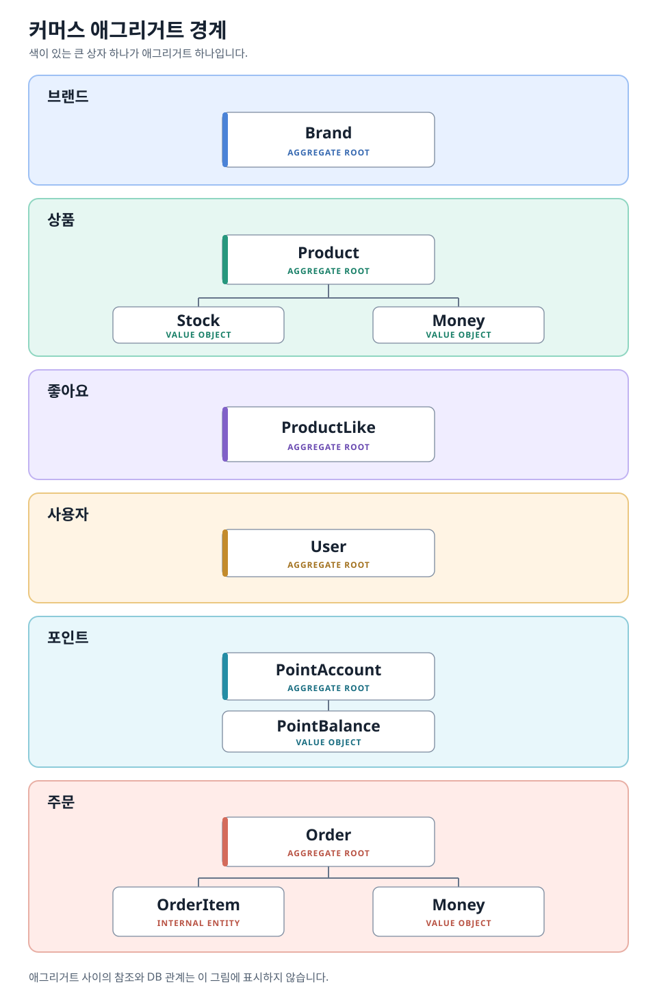
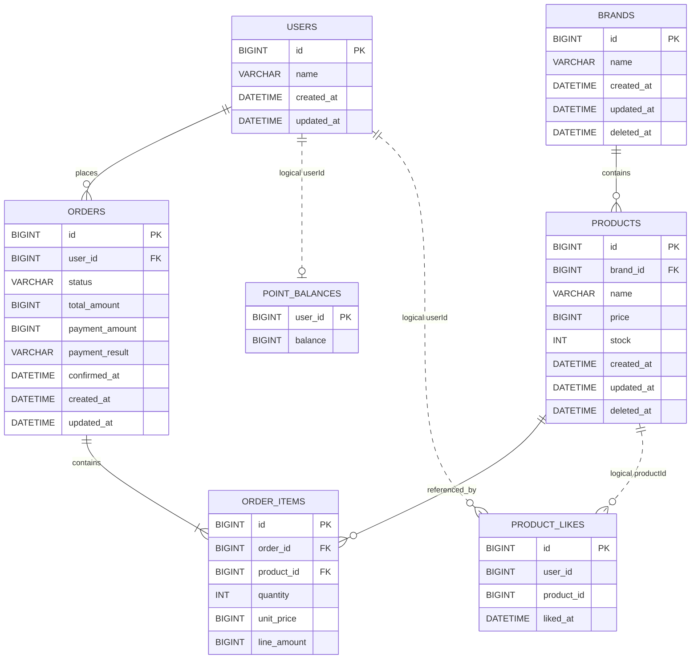

# 커머스 기본 기능 설계

## 1. 문서 목적

이 문서는 2주차 커머스 기본 기능을 구현하기 전에 HTTP 계약, 객체 책임, 계층 의존,
데이터 저장 구조, 트랜잭션 경계와 테스트 기준을 합의하기 위한 상세 BE 설계 문서다.

설계는 Layered Architecture를 사용하고, 최범균의 『도메인 주도 개발 시작하기: DDD
핵심 개념 정리부터 구현까지』에서 설명하는 Entity, Value Object, Aggregate, Repository,
Application Service, DIP의 책임 구분을 참고한다. 모든 DDD 패턴을 도입하는 것이 아니라
이번 요구를 설명하고 검증하는 데 필요한 패턴만 사용한다.

- 요구사항 기준: 사용자가 2026-09-17 대화에서 제공한 2주차 Implementation Quest 원문
- 저장소 기준 revision: `963240c504662a00c7e1beda38e63e86e920b192`
- 대상 모듈: `apps/commerce-api`
- 언어와 런타임: Kotlin 2.0.20, JDK 21, Spring Boot 3.4.4
- DB: MySQL 8.0
- API 개발 구분: 신규 25개, 기존 변경 0개, 기존 유지 1개(Example)

### 근거 표기

- `[기획서]`: 위 대화에서 제공된 Implementation Quest 원문에 직접 명시된 내용
- `[사용자 결정]`: 설계 대화에서 사용자가 확정한 내용
- `[코드 확인]`: 현재 저장소에서 확인한 내용
- `[설계 결정]`: 요구를 만족하기 위해 이 문서에서 정한 기술 계약

대화에서 다시 확인했더라도 기획서에 직접 명시되었거나 필연적으로 도출되는 내용은
`[기획서]`로 표시한다. `[사용자 결정]`은 기획서가 복수 선택지를 허용했거나 기획서 밖의
제품 정책을 사용자가 확정한 경우에만 사용하고, FK·저장 위치 같은 구현 선택은
`[설계 결정]`로 구분한다.

## 2. 현재 상태와 범위

### 2.1 확인된 사실

- `[코드 확인]` 기준 revision에는 Example만 존재했다. 현재 로컬 체크아웃에는 이번 25개
  신규 API가 구현되어 있다.
- `[코드 확인]` 공통 응답은 `ApiResponse<T>`의 `meta + data` 구조다.
- `[코드 확인]` 공통 오류는 `CoreException`, `ErrorType`, `ApiControllerAdvice`로 변환된다.
- `[코드 확인]` `BaseEntity`가 `id`, `createdAt`, `updatedAt`, `deletedAt`과 멱등적인
  `delete()`, `restore()`를 제공한다.
- `[코드 확인]` 현재 패키지는 `interfaces / application / domain / infrastructure`의
  layer-first 구조다.
- `[코드 확인]` 로컬·테스트 환경은 JPA `ddl-auto=create`를 사용한다.
- `[코드 확인]` 1주차 계약은 고객 식별에 `X-USER-ID` 헤더를 사용한다.

### 2.2 확정된 제품·실습 정책

- `[기획서]` 고객은 활성 브랜드·상품을 조회하고 자신의 좋아요·포인트·주문만 다룬다.
- `[기획서]` 관리자는 브랜드·상품 전체 CRUD, 재고 변경, 주문 조회를 수행한다.
- `[기획서]` 상품 생성 후 수정할 때 브랜드는 유지한다.
- `[기획서]` 주문 생성 시 여러 품목·수량·단가·총액을 저장하고
  DRAFT 단계에서는 재고와 포인트를 차감하지 않는다.
- `[기획서]` 주문 확정 시 상품의 존재·활성 상태와 재고·잔액을 다시 확인하고, 모두
  충분할 때만 재고·포인트를 차감해 CONFIRMED로 변경한다.
- `[기획서]` 삭제 상품에는 새 좋아요를 등록할 수 없고 내 좋아요 목록에서도 제외하지만,
  삭제 전에 남아 있던 자신의 좋아요 관계는 취소할 수 있다.
- `[기획서]` 로컬 서버는 `127.0.0.1`에만 bind하고 외부에 공개하지 않는다.

- `[사용자 결정]` 브랜드와 상품은 `deletedAt`을 사용하는 soft delete로 삭제한다.
- `[사용자 결정]` 주문 입력의 중복 상품은 상품별 수량을 합산한다.
- `[사용자 결정]` 좋아요 등록과 취소는 멱등하게 처리한다.
- `[사용자 결정]` 브랜드명과 상품명은 정규화 후 1~255자다.
- `[사용자 결정]` 포인트는 상품 구매 보상으로 적립되는 무상 포인트가 아니라 사용자가
  금액을 지불해 충전한 유상 포인트다.
- `[사용자 결정]` 충전 포인트에는 유효기간을 두지 않는다.
- `[사용자 결정]` 환불 대상으로 확정된 포인트는 수수료나 소멸 없이 100% 반환한다.
- `[이전 사용자 결정]` 현재 포인트 잔액을 `users.point_balance`에 저장했으나,
  이후 포인트의 충전·사용 책임을 별도 `PointAccount` Aggregate로 분리하기로 변경했다.
- `[사용자 결정]` `users`에는 포인트 잔액을 두지 않고 `point_balances`에 저장한다.
- `[사용자 결정]` 동시성 제어는 3주차에서 다루고 2주차에서는 구현하지 않는다.
- `[사용자 결정]` `@Transactional`은 모든 공개 service 메서드에 일괄 적용하지 않고,
  한 유스케이스의 여러 저장 또는 저장 후 작업을 함께 rollback해야 하는 경계에만 둔다.
- `[사용자 결정]` 학습을 위해 2주차 커머스의 모든 Aggregate에서 domain model과 JPA
  저장 entity를 분리한다. application은 domain Repository 계약만 사용한다.
- `[사용자 결정]` domain Repository 구현체도 JPA를 모르게 한다. 구현체는 저장 기술과
  무관한 `*EntityRepository` 계약과 `OrderEntity` 같은 저장 데이터만 사용하고,
  JPA 구현체가 실제 저장을 맡는다.

- `[설계 결정]` ProductLike는 User·Product의 식별자만 저장하고 물리 FK를 두지 않는다.
- `[설계 결정]` 주문 확정의 재고·포인트·주문 변경은 하나의 application transaction으로 묶는다.

### 2.3 명시적 비범위

- 쿠폰 할인
- 현재 25개 API에서 주문 취소·포인트 환불·충전 취소를 실행하는 기능
- 배송, 결제 게이트웨이, 외부 인증 서버
- 삭제한 브랜드·상품의 복원 API
- 관리자용 네트워크 로그인
- 운영 환경 배포와 실제 개인정보·비밀정보 사용
- Domain Event, Event Sourcing, 복잡한 CQRS, 마이크로서비스 분리
- 검색어, 카테고리, 장바구니, 주문 상태 변경 이력

## 3. 요구사항 지도

### 3.1 고객 상품 탐색

- Actor: 식별 여부와 관계없이 상품을 탐색하는 고객
- Read: 활성 브랜드 상세, 활성 상품 목록·상세, 브랜드 정보, 좋아요 수
- Derived: Like 관계에서 계산한 `likeCount`
- Failure: 잘못된 ID·필터·정렬·페이지, 없거나 삭제된 대상
- Scope: 직접

### 3.2 고객 좋아요

- Actor: `X-USER-ID`로 식별된 고객
- Read: 자신의 활성 상품 좋아요 목록
- Write: 사용자–상품 Like 관계 생성·제거
- Derived: 등록·취소 후 상품의 현재 `likeCount`
- Failure: 식별 누락, 없는 사용자, 사용자 경로 불일치, 없거나 삭제된 상품
- Scope: 직접

### 3.3 고객 포인트와 주문

- Actor: `X-USER-ID`로 식별된 고객
- Read: 자신의 포인트 잔액과 주문 목록·상세
- Write: 포인트 충전, DRAFT 주문 생성, 주문 확정
- Derived: 중복 품목 합산, 품목 금액, 주문 합계, 결제 후 잔액
- Side effect: 주문 확정 시 재고·포인트 차감과 결제 결과 저장
- Failure: 잘못된 금액·수량, 없는 사용자·상품·주문, 소유권 위반, 재고·잔액 부족,
  중복 확정
- Scope: 직접

### 3.4 관리자 운영

- Actor: Spring Security의 `ADMIN` role을 가진 모의 관리자
- Read: 활성 브랜드·상품, 모든 구매자의 주문
- Write: 브랜드·상품 생성·수정·soft delete, 상품 최종 재고 변경
- Failure: 일반 사용자·미식별 요청, 유효하지 않은 값, 비활성 대상, 활성 상품이 남은
  브랜드 삭제
- Scope: 직접

## 4. 버드뷰

```text
고객
 ├─ 브랜드·상품 조회
 ├─ 좋아요 등록·취소·내 목록
 └─ 포인트 충전·조회·주문 생성·확정·조회
                         │
                         ▼
              ┌────────────────────┐
관리자 ──────▶│ commerce-api       │
 브랜드·상품  │ interfaces        │
 CRUD·재고    │       ↓            │
 주문 조회    │ application       │
              │       ↓            │
              │ domain            │
              │       ↑            │
              │ infrastructure    │
              └─────────┬──────────┘
                        │ JPA
                        ▼
                     MySQL 8
```

- 고객 API와 관리자 API는 같은 도메인 데이터를 사용하지만 인증·입력·응답 계약은 다르다.
- HTTP 요청은 interfaces가 받고 application이 유스케이스를 조율한다.
- domain은 자신의 상태와 규칙을 지키며 repository의 저장 약속을 정의한다.
- infrastructure의 Repository 구현체는 기술 중립 `*EntityRepository` 계약을 사용하고, JPA 구현체가 실제 저장을 맡는다.

## 5. Layered Architecture와 의존 규칙

```text
interfaces ─────▶ application ─────▶ domain
                                      ▲
                                      │
infrastructure ────────────────────────┘
```

### 5.1 계층별 책임

#### interfaces

- HTTP method/path와 request/response DTO
- `X-USER-ID` 및 관리자 principal 추출
- JSON·path·query 형식 검증
- application 결과를 `ApiResponse<T>`로 변환
- application/domain 실패를 HTTP status와 error code로 변환
- infrastructure 구현 타입에 직접 의존하지 않음

#### application

- 하나의 사용자 목적을 완성하는 호출 순서
- 사용자·관리자 권한과 리소스 소유권 확인
- 여러 Aggregate 조회와 행동 호출
- 조회 결과 조합
- 여러 작업이 함께 성공하거나 실패해야 하는 쓰기 유스케이스의 트랜잭션 경계
- interfaces DTO와 infrastructure 구현 타입에 의존하지 않음

#### domain

- Entity, Value Object, Aggregate와 불변식
- 의미가 드러나는 상태 변경 행동
- Aggregate Root 단위 Repository 인터페이스
- HTTP DTO·status, application, infrastructure에 의존하지 않음
- 2주차 커머스 domain에는 JPA·Hibernate annotation을 두지 않음

#### infrastructure

- domain Repository 구현은 기술 중립 `*EntityRepository` 계약과 저장 데이터로 domain 객체를 변환
- JPA 구현체만 JPA entity와 Spring Data JPA repository를 사용
- Spring Data JPA와 필요한 native SQL을 이용한 목록·집계 조회
- HTTP 응답과 권한 정책을 구현하지 않음

### 5.2 ArchUnit으로 검사할 규칙

```text
domain         -X-> interfaces, application, infrastructure
application    -X-> interfaces, infrastructure
interfaces     -X-> infrastructure
```

2주차 커머스 domain의 JPA·Hibernate 의존도 금지한다. 기존 Example은 starter 범위로
유지한다. 폴더 이름뿐 아니라 생성자, 메서드 parameter, 반환 타입과 annotation으로
생기는 타입 의존도 검사한다.
커머스의 domain Repository 구현체는 `JpaRepository`, JPA entity와 Spring Data 타입에
직접 의존하지 않는지도 검사한다.

### 5.3 현재 패키지

```text
com.loopers
├── interfaces/api/{brand,product,like,point,order,admin}
├── application/{brand,product,like,point,order,common}
├── domain/{brand,product,like,point,order,user,commerce}
└── infrastructure/{brand,product,like,point,order,user}
```

### 5.4 VO·DTO와 계층 경계 매핑

VO는 유효한 도메인 값을 표현하고, DTO는 HTTP 또는 유스케이스 경계를 넘어 데이터를
전달한다. Kotlin의 `data class` 여부나 저장 테이블의 개수로 둘을 구분하지 않는다.
VO를 DTO로 캐스팅하지 않고 바깥 계층이 필요한 값을 읽어 자신의 DTO로 매핑한다.

| 타입 | 소유 계층 | 이 과제의 예 | 변경 이유 |
|---|---|---|---|
| Request·Response DTO | interfaces | `ChargePointRequest`, `PointResponse` | HTTP 입력·출력 계약 |
| Result·Input | application | `PointResult`, `OrderItemInput` | 유스케이스 입출력 |
| Entity·VO | domain | `User`, `PointAccount`, `PointBalance`, `Money` | 상태와 업무 규칙 |

```text
JSON → Request DTO → application 입력 → PointAccount 행동 → Result → Response DTO → JSON
       interfaces        application            domain           application  interfaces
```

- interfaces가 Request를 application 입력으로, Result를 HTTP Response로 매핑한다.
- application이 primitive 입력을 VO로 만들고 Entity·VO의 필요한 값을 Result로 매핑한다.
- domain은 interfaces·application의 DTO 타입과 JSON 필드명을 모른다.
- Domain Service를 도입한다면 DTO가 아니라 Entity·VO 같은 domain 타입을 받는다.
- 단순 유스케이스에 불필요한 중간 DTO를 늘리지 않되, application이 interfaces DTO에
  직접 의존하거나 Entity를 HTTP 응답으로 그대로 노출하지 않는다. 별도 Input 클래스는
  여러 입력을 묶어야 하는 경계에서만 만든다.
- `PointBalance` VO를 `point_balances.balance` 컬럼에 매핑하는 일은 DTO 변환이 아니라
  infrastructure의 JPA 저장 매핑이다.

## 6. 도메인 모델과 애그리거트 경계

애그리거트는 **함께 일관성을 지켜야 하는 객체의 경계**다. 현재 모델은 여섯 경계로 나뉜다.
색이 있는 상자는 각 애그리거트이며, 선은 그 안의 루트와 내부 객체만 연결한다. 다른
애그리거트로 향하는 선과 DB 관계는 표시하지 않는다.



| 애그리거트 | 루트 | 경계 안의 객체 | 경계 밖에 두는 것 | 저장 위치 |
|---|---|---|---|---|
| 브랜드 | `Brand` | 없음 | `Product` 목록 | `brands` |
| 상품 | `Product` | `Stock`, 가격 `Money` VO | `Brand`, `ProductLike` | `products` |
| 좋아요 | `ProductLike` | 없음 — 단일 Entity 애그리거트 | `User`, `Product` | `product_likes` |
| 사용자 | `User` | 없음 | `PointAccount`, `Order`, `ProductLike` | `users` |
| 포인트 | `PointAccount` | `PointBalance` VO | `User`, `Order` | `point_balances` |
| 주문 | `Order` | `OrderItem` 내부 Entity, 금액 `Money` VO | `User`, `Product` | `orders`, `order_items` |

`PointAccount`는 사용자별 포인트 잔액의 독립 Aggregate Root다. 충전·사용 행동은
`PointAccount`가 공개하고 `PointBalance` VO가 값의 규칙을 지킨다. User의 존재 확인은
application이 수행하며 PointAccount는 User 객체가 아니라 `userId`만 보유한다.

애그리거트 경계와 테이블 경계는 같지 않다. `PointAccount`와 `PointBalance`는 한 테이블에
저장되고, `Order`와 `OrderItem`은 두 테이블에 저장된다. `Money` 타입은 상품과 주문
경계에서 각각 값으로 사용할 수 있지만 이를 공유 애그리거트로 만들지는 않는다.

경계 밖 대상이 필요한 유스케이스는 해당 객체를 애그리거트 안에 편입하지 않고 식별자로
연결한다. `Product.brandId`, `ProductLike.userId/productId`, `Order.userId`,
`OrderItem.productId`가 그 예다. 여러 루트의 존재·활성 여부 확인과 협력 순서는
application이 Repository를 통해 조율한다.

Repository는 루트 단위로 둔다. `BrandRepository`, `ProductRepository`,
`ProductLikeRepository`, `UserRepository`, `PointAccountRepository`, `OrderRepository`가 대상이며,
`PointBalanceRepository`나 독립적인 `OrderItemRepository`는 만들지 않는다. 내부 객체의
상태 변경은 해당 루트의 행동을 거친다.

### 6.1 Brand Aggregate

- Aggregate Root: `Brand`
- 경계: `Brand`만 포함한다. 연결된 `Product`는 상품 애그리거트이지 자식 Entity가 아니다.
- 상태: `id`, `name`, `createdAt`, `updatedAt`, `deletedAt`
- 행동: 생성, 이름 변경, soft delete
- 불변식: 정규화한 이름은 1~255자
- 책임 밖: 연결 상품 조회와 삭제 가능 여부 판단

브랜드 삭제 유스케이스는 application이 `ProductRepository.existsActiveByBrandId()`를 호출해
활성 상품이 하나라도 있으면 거절한 뒤 `brand.delete()`를 호출한다.

### 6.2 Product Aggregate

- Aggregate Root: `Product`
- Value Object: `Money`, `Stock`
- 경계: `brandId`는 다른 루트의 식별자일 뿐 `Brand` 객체를 포함하지 않는다.
  좋아요 관계 역시 상품의 자식 컬렉션으로 보관하지 않는다.
- `Stock`은 독립 Aggregate가 아닌 불변 VO다. `decrease(quantity)`와
  `adjustTo(finalQuantity)`는 새 `Stock`을 반환한다. Product를 구현할 때 Root가
  반환값을 자신의 재고 상태에 반영하며, 외부에서 Stock만 저장하지 않는다.
- 상태: `brandId`, `name`, `price`, `stock`, `deletedAt`
- 행동: 이름·가격 변경, 재고 차감, 최종 재고 변경, soft delete
- 불변식:
  - 정규화한 이름은 1~255자
  - 가격은 `0..Long.MAX_VALUE`
  - 재고는 `0..Int.MAX_VALUE`
  - 차감 수량은 양수이며 현재 재고 이하여야 함
- 책임 밖: 브랜드명 조회, 좋아요 수 집계, HTTP 응답 조합

상품 생성 시 활성 브랜드를 조회한다. 생성 후 `brandId`는 바뀌지 않는다.

### 6.3 ProductLike Aggregate

- Aggregate Root: `ProductLike` — 단일 Entity가 하나의 좋아요 관계를 이룬다.
- 경계: `User`와 `Product` 객체는 포함하지 않는다.
- 식별 관계: `(userId, productId)`
- 상태: `id`, `userId`, `productId`, `likedAt`
- 생성 조건: 사용자와 상품이 존재하고 상품이 활성 상태
- 제거 조건: 요청 사용자와 Like의 `userId`가 일치
- 저장 제약: `(user_id, product_id)` unique
- 삭제 방식: 관계 행 hard delete
- 참조 방식: User·Product 객체 대신 `userId`, `productId` scalar 값 저장
- 물리 FK: 두지 않음

좋아요 수는 Product에 counter로 저장하지 않고 활성 Like 관계를 집계한다. 상품을 soft
delete해도 Like 행은 남기므로 자신의 기존 관계는 취소할 수 있다. 내 좋아요 목록에서는
삭제된 상품을 제외한다.

#### 6.3.1 ProductLike 생명주기 정책

| 사건 | ProductLike 저장 상태 | 외부 조회·행동 | 책임 |
|---|---|---|---|
| Product soft delete | 관계 행 유지 | 고객 상품·내 좋아요 목록에서 제외, 기존 Like 취소 허용 | Product delete/query application |
| ProductLike 취소 | 관계 행 hard delete | 반복 취소도 성공 | Like application |

현재 Product 삭제는 soft delete이고 User 삭제 API는 없다. 따라서 물리 FK는 현재 요구의
삭제 규칙을 보장하지 못하면서 Aggregate 사이 JPA 연관만 늘린다. 좋아요 등록 시 application이
User 존재와 Product 활성 상태를 검사하고 DB unique가 중복 관계를 막는다. 향후 부모의
hard delete가 실제 범위에 들어오면 orphan 방지와 정리 순서를 함께 다시 결정한다.

### 6.4 PointAccount Aggregate와 PointBalance Value Object

- Aggregate Root: `PointAccount`
- Value Object: `PointBalance`
- 경계: 포인트 충전·결제는 `PointAccount` 행동을 통해 수행한다. `User`는 사용자 식별·정보만 책임진다.
- 상태: `userId`, `balance`; `userId`가 사용자별 포인트 계정의 식별자다.
- 행동: `charge(amount)`, `pay(amount)`
- 불변식:
  - 잔액 0 허용
  - 충전액은 양수
  - 결제액은 0 이상이며 0원 결제는 잔액을 바꾸지 않음
  - 충전 후 잔액은 `Long.MAX_VALUE` 이하
  - 결제액은 현재 잔액 이하

`Money(0)`은 유효하지만 `charge(Money(0))`는 유효한 행동이 아니다. 값의 유효성과 특정
행동의 입력 규칙을 구분한다.

`PointBalance`는 음수 잔액과 범위 초과를 거절하고 새로운 잔액 값을 반환하는 불변 VO로
구현한다. `PointAccount`가 그 값을 자신의 상태로 교체한다. 별도 계정 행이 없는
기존 사용자의 잔액 조회 결과는 0이다. 첫 충전에서 계정 행을 만들며, 주문 확정도
잔액 0인 계정으로 부족 여부를 판단한다. DB의 `user_id` PK로 사용자당 계정 하나를 보장한다.
이번 주차의 동시성 제어 비범위 정책은 그대로 유지한다.

#### 6.4.1 포인트 정책 결정 기록

| ID | 구분 | 정책 | 이유와 영향 |
|---|---|---|---|
| `POINT-POL-001` | 확정 | 포인트는 사용자가 금액을 지불해 충전한다. | 보상·이벤트 적립 포인트와 다른 유상 가치로 취급한다. |
| `POINT-POL-002` | 확정 | 충전 포인트는 만료되지 않는다. | 만료일별 사용 순서와 만료 배치가 필요하지 않다. |
| `POINT-POL-003` | 확정 | 환불 대상으로 인정된 금액은 100% 반환한다. | 환불 수수료나 기간 경과에 따른 차감은 적용하지 않는다. |
| `POINT-POL-004` | 현재 범위 | 이번 구현은 충전·잔액 조회·주문 결제까지만 포함한다. | 환불 endpoint와 주문 취소 상태를 임의로 추가하지 않는다. |

환불 API와 주문 취소 API는 이번 범위에 없으므로 반환 조건·부분 환불·충전 취소는 현재
설계와 구현의 고려 대상이 아니다. `POINT-POL-003`은 향후 환불 기능을 설계할 때 사용할
제품 원칙만 기록한다.

### 6.5 Order Aggregate

- Aggregate Root: `Order`
- 내부 Entity: `OrderItem`
- Value Object: 품목 단가·금액, 주문 합계·결제액의 `Money`
- 경계: 생성 시 품목 구성·금액 계산·상태 전이는 `Order`를 통해 수행한다. `User`와
  `Product`는 주문 내부 Entity가 아니며 상품 단가만 주문 생성 시 snapshot으로 복사한다.
- 상태: `userId`, `status`, `items`, `totalAmount`, `paymentAmount`, `paymentResult`,
  `confirmedAt`
- 상태 전이: `DRAFT -> CONFIRMED`
- 생성 시: 품목·합계 snapshot 저장, 재고·포인트 변경 없음
- 확정 시: 저장된 합계로 결제 결과를 기록하고 상태 전이

`OrderItem`은 다음 snapshot을 저장한다.

- `productId`
- 합산된 `quantity`
- 주문 생성 시점의 `unitPrice`
- `lineAmount = unitPrice * quantity`

같은 상품이 여러 번 입력되면 `productId`별로 수량을 먼저 합산한다. 합산 결과가
`Int.MAX_VALUE`를 넘거나 금액 계산이 `Long` 범위를 넘으면 주문 전체를 거절한다.

Order는 Product나 PointAccount의 잔액을 직접 참조하거나 repository를 호출하지 않는다.
application이 필요한 Aggregate를 조회해 행동을 호출한다.

## 7. 핵심 불변식과 기대값

| ID | 규칙 | 반례 | 기대 결과 | 책임 |
|---|---|---|---|---|
| `INV-001` | 브랜드·상품 이름은 trim 후 1~255자다. | 공백 또는 256자 | 400, 저장 없음 | Brand, Product |
| `INV-002` | 가격과 최종 재고는 0 이상이다. | 가격 -1, 재고 -1 | 400, 기존 값 유지 | Money, Stock |
| `INV-003` | 재고 차감 수량은 양수이고 잔여 재고 이하다. | 재고 5에서 0 또는 6 차감 | 400 또는 409, 재고 5 유지 | Stock |
| `INV-004` | 같은 사용자–상품 Like는 하나다. | 같은 좋아요 반복 | 성공, 관계 1개 유지 | Like use case, DB unique |
| `INV-005` | 삭제 상품은 새 좋아요·고객 조회·새 주문에서 제외한다. | 삭제 상품 ID 요청 | 404, 상태 변화 없음 | Application query/use case |
| `INV-006` | 잔액은 0 이상이고 충전액은 양수, 결제액은 0 이상이다. | 0 충전, 음수·잔액 초과 결제 | 400/409, 잔액 유지 | PointAccount/PointBalance |
| `INV-007` | 중복 주문 품목은 하나로 합산한다. | 상품 A 2개 + A 3개 | A 수량 5인 OrderItem 하나 | Order create use case |
| `INV-008` | 주문 생성은 재고·포인트를 차감하지 않는다. | 합계 7,000원 주문 생성 | DRAFT 저장, 잔액·재고 동일 | Order create use case |
| `INV-009` | 주문 금액은 생성 시점 단가 snapshot이다. | 생성 후 상품 가격 변경 | 주문 단가·합계 불변 | Order, OrderItem |
| `INV-010` | 확정은 본인의 DRAFT 주문에 한 번만 가능하다. | 타인 주문 또는 재확정 | 403/409, 상태 변화 없음 | Order, confirm use case |
| `INV-011` | 확정은 모든 재고와 잔액이 충분해야 원자적으로 성공한다. | 두 번째 품목 재고 부족 | 모든 재고·잔액·주문 유지 | confirm transaction |
| `INV-012` | 활성 상품이 남은 브랜드는 삭제할 수 없다. | 재고 0인 활성 상품 존재 | 409, 브랜드 활성 유지 | Brand delete use case |
| `INV-013` | 실패한 변경은 기존 상태를 유지한다. | overflow 충전, 권한 실패 | 트랜잭션 rollback | Application transaction |
| `INV-014` | 충전 포인트는 시간 경과만으로 감소하거나 만료되지 않는다. | 충전 후 장기간 미사용 | 기존 잔액 유지 | PointAccount/PointBalance policy |
| `INV-015` | Product soft delete는 ProductLike를 삭제하지 않는다. | Like가 있는 Product 삭제 | Like 유지, 고객 목록 제외, 취소 허용 | Product/Like application |

## 8. 대표 객체 협력 흐름

### 8.1 관리자 변경 후 고객 조회

```text
관리자
  -> AdminProductController: PUT 상품 수정
  -> Spring Security: ADMIN 권한 확인
  -> ProductApplicationService
  -> ProductRepository: 활성 상품 조회
  -> Product: changeDetails()
  -> transaction commit

고객
  -> ProductController: GET 상품 상세
  -> CustomerProductQueryService
  -> ProductRepository: 활성 상품 조회
  -> BrandRepository: 활성 브랜드 조회
  -> ProductLikeRepository: 좋아요 수 집계
  -> CustomerProductResult 조합
  -> ApiResponse.success(data)
```

브랜드 응답 필드나 좋아요 집계 방법이 바뀌어도 Product Aggregate의 가격·재고 규칙은
바뀌지 않는다.

### 8.2 좋아요 등록·취소

```text
POST 좋아요
  -> X-USER-ID 사용자 확인
  -> 활성 상품 확인
  -> 기존 관계 조회
  -> 있으면 그대로 성공
  -> 없으면 ProductLike 생성
  -> 현재 likeCount 반환

DELETE 좋아요
  -> X-USER-ID 사용자 확인
  -> 상품은 삭제 상태를 포함해 식별
  -> 자신의 관계가 있으면 제거
  -> 관계가 없어도 성공
  -> 현재 likeCount 반환
```

새 좋아요는 활성 상품에만 허용하지만, 삭제 전에 만든 관계를 취소할 때는 상품의 활성
상태를 요구하지 않는다.

### 8.3 포인트 충전부터 주문 확정

```text
1. POST /points/charge amount=10,000
   -> User 조회
   -> PointAccount 조회, 없으면 잔액 0으로 생성
   -> pointAccount.charge(10,000)
   -> 잔액 10,000 저장

2. POST /orders, 품목 합계=7,000
   -> 중복 productId 수량 합산
   -> 활성 상품과 생성 시점 가격 조회
   -> OrderItem snapshot과 DRAFT Order 저장
   -> 재고·포인트는 변경하지 않음

3. POST /orders/{orderId}/confirm
   -> 요청 사용자 확인
   -> 본인의 DRAFT Order 조회
   -> 주문 품목의 활성 Product 조회
   -> PointAccount 조회, 없으면 잔액 0으로 판단
   -> 모든 재고와 잔액 사전 검증
   -> Product.decreaseStock()
   -> PointAccount.pay(7,000)
   -> Order.confirm(): 저장된 합계로 결제액·SUCCESS 기록
   -> 한 트랜잭션으로 commit

4. GET /orders/{orderId}, GET /points
   -> Order=CONFIRMED, paymentAmount=7,000
   -> balance=3,000
```

주문 확정 중 재고·잔액 검증에 실패하면 트랜잭션이 rollback되어 재고·포인트·주문 상태가
함께 유지된다. 관리자 재고 변경 API는 요청한 최종 수량을 설정한다.

## 9. 공통 HTTP 계약

### 9.1 성공 envelope

현재 `ApiResponse<T>` 형태를 유지한다.

```json
{
  "meta": {
    "result": "SUCCESS",
    "errorCode": null,
    "message": null
  },
  "data": {}
}
```

생성 API는 `201 Created`, 나머지 성공은 `200 OK`를 사용한다. 기존 envelope과 일관성을
위해 DELETE도 `200 OK`와 `data: null`을 반환한다.

### 9.2 실패 envelope

```json
{
  "meta": {
    "result": "FAIL",
    "errorCode": "PRODUCT_NOT_FOUND",
    "message": "상품을 찾을 수 없습니다."
  },
  "data": null
}
```

| HTTP | errorCode | 조건 |
|---:|---|---|
| 400 | `INVALID_REQUEST` | JSON·path·query 타입 또는 필수값 오류 |
| 400 | `INVALID_NAME` | 이름이 trim 후 비었거나 255자 초과 |
| 400 | `INVALID_PRICE` | 가격이 음수거나 표현 범위 초과 |
| 400 | `INVALID_STOCK` | 최종 재고가 음수거나 표현 범위 초과 |
| 400 | `INVALID_QUANTITY` | 주문·차감 수량이 양수가 아님 또는 합산 overflow |
| 400 | `AMOUNT_OVERFLOW` | 품목·주문 금액 계산이 `Long` 범위를 초과 |
| 400 | `UNSUPPORTED_SORT` | 지원하지 않는 상품 정렬값 |
| 401 | `AUTHENTICATION_REQUIRED` | 고객 API에서 `X-USER-ID` 누락 |
| 403 | `USER_MISMATCH` | path의 `userId`와 요청 사용자가 다름 |
| 403 | `ORDER_NOT_OWNED` | 다른 사용자의 주문에 접근 |
| 403 | `ADMIN_FORBIDDEN` | 관리자 API에 ADMIN이 아닌 주체가 접근 |
| 404 | `USER_NOT_FOUND` | 식별한 사용자가 존재하지 않음 |
| 404 | `BRAND_NOT_FOUND` | 브랜드가 없거나 고객/변경 대상에서 삭제됨 |
| 404 | `PRODUCT_NOT_FOUND` | 상품이 없거나 고객/변경 대상에서 삭제됨 |
| 404 | `ORDER_NOT_FOUND` | 주문이 존재하지 않음 |
| 409 | `BRAND_HAS_ACTIVE_PRODUCTS` | 활성 상품이 연결된 브랜드 삭제 |
| 409 | `ORDER_ALREADY_CONFIRMED` | CONFIRMED 주문을 다시 확정 |
| 409 | `INSUFFICIENT_STOCK` | 확정 시 상품 재고 부족 |
| 409 | `INSUFFICIENT_POINTS` | 확정 시 포인트 잔액 부족 |
| 409 | `POINT_BALANCE_OVERFLOW` | 충전 후 잔액이 `Long` 범위 초과 |
| 500 | `Internal Server Error` | 예상하지 못한 서버 오류 |

domain은 HTTP status를 판단하지 않는다. domain/application 실패 사유를 interfaces의
`ApiControllerAdvice`가 위 계약으로 매핑한다.

### 9.3 고객 식별

- 공개 조회: 브랜드 상세, 상품 목록·상세는 `X-USER-ID` 불필요
- 개인 기능: 좋아요, 포인트, 주문은 `X-USER-ID: Long` 필수
- `GET /api/v1/users/{userId}/likes`는 header 사용자와 path 사용자가 같아야 함
- header가 없으면 401, 숫자가 아니면 400, 사용자가 없으면 404

### 9.4 관리자 경계

- `/api-admin/**`는 Spring Security의 `ROLE_ADMIN`만 허용
- `ROLE_USER`와 미식별 요청은 모두 403
- POST·PUT·DELETE MockMvc 요청은 유효한 CSRF token을 포함
- 애플리케이션의 `server.address`는 `127.0.0.1`
- 이 설정은 로컬 실습과 테스트 경계이며 운영 인증 방식으로 사용하지 않음

### 9.5 페이지와 정렬

```kotlin
data class PageResult<T>(
    val content: List<T>,
    val page: Int,
    val size: Int,
    val totalElements: Long,
    val totalPages: Int,
)
```

- `page`: 기본 0, 0 이상
- `size`: 기본 20, 1~100
- 상품 `sort`: 기본 `latest`
- `latest`: `createdAt DESC, id DESC`
- `price_asc`: `price ASC, id DESC`
- `likes_desc`: `likeCount DESC, id DESC`
- 필터 결과가 없으면 200과 빈 `content`

### 9.6 주요 Response 모델

```kotlin
data class BrandResponse(val id: Long, val name: String)

data class CustomerProductResponse(
    val id: Long,
    val name: String,
    val price: Long,
    val stock: Int,
    val brand: BrandResponse,
    val likeCount: Long,
    val createdAt: ZonedDateTime,
)

data class LikeResult(
    val productId: Long,
    val liked: Boolean,
    val likeCount: Long,
)

data class PointResponse(val userId: Long, val balance: Long)

data class OrderItemResponse(
    val productId: Long,
    val quantity: Int,
    val unitPrice: Long,
    val lineAmount: Long,
)

data class OrderResponse(
    val id: Long,
    val userId: Long,
    val status: OrderStatus,
    val items: List<OrderItemResponse>,
    val totalAmount: Long,
    val paymentAmount: Long?,
    val paymentResult: PaymentResult?,
    val createdAt: ZonedDateTime,
    val confirmedAt: ZonedDateTime?,
)

data class AdminBrandResponse(
    val id: Long,
    val name: String,
    val createdAt: ZonedDateTime,
    val updatedAt: ZonedDateTime,
)

data class AdminProductResponse(
    val id: Long,
    val name: String,
    val price: Long,
    val stock: Int,
    val brand: BrandResponse,
    val createdAt: ZonedDateTime,
    val updatedAt: ZonedDateTime,
)
```

시간은 ISO-8601 문자열로 직렬화한다. DRAFT 주문의 `paymentAmount`, `paymentResult`,
`confirmedAt`은 `null`이고 CONFIRMED 주문은 모두 값이 있어야 한다.

## 10. API 설계

모든 API는 신규다. 목록 query의 `brandId`, `userId`가 존재하지 않거나 결과가 없을 때는
단건 오류 대신 빈 page를 반환한다.

### 10.1 고객 브랜드·상품

#### 1. 브랜드 상세 조회

```http
GET /api/v1/brands/{brandId}
```

- 개발 구분: 신규
- Param: `brandId: Long` — 양수
- Query: 없음
- Body: 없음
- Response: `ApiResponse<BrandResponse>`
- 성공: 200, 활성 브랜드 정보
- 권한: 공개
- 주요 오류: `400 INVALID_REQUEST`, `404 BRAND_NOT_FOUND`
- 역할: 고객이 사용할 수 있는 브랜드 한 건 조회
- 사용 상황: 고객이 브랜드 정보를 확인할 때 호출
- 기획서 연계: `[직접]` 상품·브랜드·좋아요 > 브랜드 상세

#### 2. 상품 목록 조회

```http
GET /api/v1/products
```

- 개발 구분: 신규
- Param: 없음
- Query:
  - `brandId?: Long` — 활성 브랜드 상품 필터
  - `page?: Int = 0`
  - `size?: Int = 20`
  - `sort?: latest | price_asc | likes_desc = latest`
- Body: 없음
- Response: `ApiResponse<PageResult<CustomerProductResponse>>`
- 성공: 200, 활성 상품과 활성 브랜드 정보, Like 집계 수
- 권한: 공개
- 주요 오류: `400 INVALID_REQUEST`, `400 UNSUPPORTED_SORT`
- 역할: 필터·페이지·안정적인 정렬이 적용된 고객 상품 목록 제공
- 사용 상황: 고객이 상품 목록을 탐색하거나 브랜드·정렬 조건을 바꿀 때 호출
- 기획서 연계: `[직접]` 상품·브랜드·좋아요 > 상품 목록·목록 조건

#### 3. 상품 상세 조회

```http
GET /api/v1/products/{productId}
```

- 개발 구분: 신규
- Param: `productId: Long` — 양수
- Query: 없음
- Body: 없음
- Response: `ApiResponse<CustomerProductResponse>`
- 성공: 200, 브랜드 정보와 현재 Like 집계 수를 포함한 활성 상품
- 권한: 공개
- 주요 오류: `400 INVALID_REQUEST`, `404 PRODUCT_NOT_FOUND`
- 역할: 고객 상품 상세 제공
- 사용 상황: 고객이 상품 한 건의 가격·재고·브랜드·좋아요 수를 확인할 때 호출
- 기획서 연계: `[직접]` 상품·브랜드·좋아요 > 상품 상세

### 10.2 고객 좋아요

#### 4. 상품 좋아요 등록

```http
POST /api/v1/products/{productId}/likes
```

- 개발 구분: 신규
- Param: `productId: Long` — 양수
- Header: `X-USER-ID: Long` — 필수
- Query: 없음
- Body: 없음
- Response: `ApiResponse<LikeResult>`
- 성공: 200, `liked=true`; 기존 관계가 있어도 같은 결과
- 권한: 존재하는 요청 사용자
- 주요 오류: `400 INVALID_REQUEST`, `401 AUTHENTICATION_REQUIRED`,
  `404 USER_NOT_FOUND`, `404 PRODUCT_NOT_FOUND`
- 역할: 활성 상품과 요청 사용자 사이 Like 관계를 최대 하나로 유지
- 사용 상황: 고객이 활성 상품에 좋아요를 표시할 때 호출
- 기획서 연계: `[직접]` 상품·브랜드·좋아요 > 좋아요 등록

#### 5. 상품 좋아요 취소

```http
DELETE /api/v1/products/{productId}/likes
```

- 개발 구분: 신규
- Param: `productId: Long` — 양수
- Header: `X-USER-ID: Long` — 필수
- Query: 없음
- Body: 없음
- Response: `ApiResponse<LikeResult>`
- 성공: 200, `liked=false`; 관계가 없어도 성공
- 권한: 존재하는 요청 사용자
- 주요 오류: `400 INVALID_REQUEST`, `401 AUTHENTICATION_REQUIRED`,
  `404 USER_NOT_FOUND`, `404 PRODUCT_NOT_FOUND`
- 삭제 상품 예외: DB에 상품 행이 남아 있으면 취소 가능; 물리적으로 존재하지 않으면 404
- 역할: 요청 사용자의 Like 관계만 제거
- 사용 상황: 고객이 자신의 좋아요를 취소할 때 호출
- 기획서 연계: `[직접]` 상품·브랜드·좋아요 > 좋아요 취소

#### 6. 내 좋아요 상품 목록 조회

```http
GET /api/v1/users/{userId}/likes
```

- 개발 구분: 신규
- Param: `userId: Long` — 양수
- Header: `X-USER-ID: Long` — 필수, path와 같아야 함
- Query: `page?: Int = 0`, `size?: Int = 20`
- Body: 없음
- Response: `ApiResponse<PageResult<CustomerProductResponse>>`
- 성공: 200, 자신의 Like 중 활성 상품만 최신 좋아요순(`likedAt DESC, id DESC`) 조회
- 권한: path 사용자 본인
- 주요 오류: `400 INVALID_REQUEST`, `401 AUTHENTICATION_REQUIRED`,
  `403 USER_MISMATCH`, `404 USER_NOT_FOUND`
- 역할: 자신의 활성 상품 좋아요 관계 조회
- 사용 상황: 고객이 자신이 좋아요한 상품 목록을 확인할 때 호출
- 기획서 연계: `[직접]` 상품·브랜드·좋아요 > 내 좋아요 목록

### 10.3 고객 포인트

#### 7. 내 포인트 충전

```http
POST /api/v1/points/charge
```

- 개발 구분: 신규
- Header: `X-USER-ID: Long` — 필수
- Param: 없음
- Query: 없음
- Body: `{ "amount": Long }` — 양수 JSON 정수, 필수. 숫자 문자열·소수·`Long` 범위 초과는 400
- Response: `ApiResponse<PointResponse>`
- 성공: 200, 충전 후 잔액
- 권한: 존재하는 요청 사용자
- 주요 오류: `400 INVALID_REQUEST`, `401 AUTHENTICATION_REQUIRED`,
  `404 USER_NOT_FOUND`, `409 POINT_BALANCE_OVERFLOW`
- 원자성: 실패 시 기존 잔액 유지
- 역할: 자신의 PointAccount Aggregate 잔액에 충전액 추가
- 사용 상황: 고객이 주문 결제에 사용할 포인트를 충전할 때 호출
- 기획서 연계: `[직접]` 포인트·주문 > 내 포인트 충전

#### 8. 내 포인트 잔액 조회

```http
GET /api/v1/points
```

- 개발 구분: 신규
- Header: `X-USER-ID: Long` — 필수
- Param: 없음
- Query: 없음
- Body: 없음
- Response: `ApiResponse<PointResponse>`
- 성공: 200, 현재 잔액. 계정 행이 없으면 0
- 권한: 존재하는 요청 사용자
- 주요 오류: `400 INVALID_REQUEST`, `401 AUTHENTICATION_REQUIRED`, `404 USER_NOT_FOUND`
- 역할: 자신의 저장된 포인트 잔액 조회
- 사용 상황: 고객이 충전 또는 주문 전후의 현재 잔액을 확인할 때 호출
- 기획서 연계: `[직접]` 포인트·주문 > 내 잔액 조회

실습 사용자 fixture는 포인트 계정 없이 만든다. 계정 행이 없으면 조회 잔액은 0이며,
첫 충전 시 `point_balances` 행을 생성한다.

### 10.4 고객 주문

#### 9. 주문 생성

```http
POST /api/v1/orders
```

- 개발 구분: 신규
- Header: `X-USER-ID: Long` — 필수
- Param: 없음
- Query: 없음
- Body:

```json
{
  "items": [
    { "productId": 1, "quantity": 2 },
    { "productId": 1, "quantity": 3 },
    { "productId": 2, "quantity": 1 }
  ]
}
```

- Body 규칙: `items`는 비어 있지 않고 각 ID는 양수, 각 수량은 양수
- 중복 처리: 위 입력은 상품 1 수량 5, 상품 2 수량 1의 OrderItem 두 개로 저장
- Response: `ApiResponse<OrderResponse>`
- 성공: 201, DRAFT 주문과 생성 시점 가격 snapshot
- 권한: 존재하는 요청 사용자
- 주요 오류: `400 INVALID_REQUEST`, `400 INVALID_QUANTITY`, `400 AMOUNT_OVERFLOW`,
  `401 AUTHENTICATION_REQUIRED`, `404 USER_NOT_FOUND`, `404 PRODUCT_NOT_FOUND`
- 원자성: 하나라도 잘못되면 주문·품목을 전혀 저장하지 않음
- 역할: 여러 활성 상품으로 미결제 주문 생성
- 사용 상황: 고객이 선택한 여러 상품으로 결제 전 주문을 만들 때 호출
- 기획서 연계: `[직접]` 포인트·주문 > 주문 생성

응답과 저장된 OrderItem 순서는 `productId ASC`로 정규화한다. 입력 배열 순서는 주문의
업무 의미로 보존하지 않는다.

#### 10. 주문 확정

```http
POST /api/v1/orders/{orderId}/confirm
```

- 개발 구분: 신규
- Param: `orderId: Long` — 양수
- Header: `X-USER-ID: Long` — 필수
- Query: 없음
- Body: 없음
- Response: `ApiResponse<OrderResponse>`
- 성공: 200, CONFIRMED 주문, `paymentAmount=totalAmount`, `paymentResult=SUCCESS`
- 권한: 주문 소유자 본인
- 주요 오류: `400 INVALID_REQUEST`, `401 AUTHENTICATION_REQUIRED`,
  `403 ORDER_NOT_OWNED`, `404 USER_NOT_FOUND`, `404 ORDER_NOT_FOUND`,
  `404 PRODUCT_NOT_FOUND`, `409 ORDER_ALREADY_CONFIRMED`, `409 INSUFFICIENT_STOCK`,
  `409 INSUFFICIENT_POINTS`
- 원자성: 상품 전체 재고·포인트·주문 상태를 한 트랜잭션으로 변경
- 역할: 저장된 주문 금액으로 포인트 결제를 완료하고 재고를 차감
- 사용 상황: 고객이 자신의 DRAFT 주문을 포인트로 결제해 확정할 때 호출
- 기획서 연계: `[직접]` 포인트·주문 > 주문 확정

#### 11. 내 주문 목록 조회

```http
GET /api/v1/orders
```

- 개발 구분: 신규
- Header: `X-USER-ID: Long` — 필수
- Param: 없음
- Query: `page?: Int = 0`, `size?: Int = 20`
- Body: 없음
- Response: `ApiResponse<PageResult<OrderResponse>>`
- 성공: 200, 자신의 주문을 `createdAt DESC, id DESC`로 조회
- 권한: 존재하는 요청 사용자
- 주요 오류: `400 INVALID_REQUEST`, `401 AUTHENTICATION_REQUIRED`, `404 USER_NOT_FOUND`
- 역할: 자신의 DRAFT·CONFIRMED 주문 목록 조회
- 사용 상황: 고객이 자신의 주문 이력을 목록으로 확인할 때 호출
- 기획서 연계: `[직접]` 포인트·주문 > 내 주문 목록

#### 12. 내 주문 상세 조회

```http
GET /api/v1/orders/{orderId}
```

- 개발 구분: 신규
- Param: `orderId: Long` — 양수
- Header: `X-USER-ID: Long` — 필수
- Query: 없음
- Body: 없음
- Response: `ApiResponse<OrderResponse>`
- 성공: 200, 품목·수량·단가·금액·상태·결제 결과
- 권한: 주문 소유자 본인
- 주요 오류: `400 INVALID_REQUEST`, `401 AUTHENTICATION_REQUIRED`,
  `403 ORDER_NOT_OWNED`, `404 USER_NOT_FOUND`, `404 ORDER_NOT_FOUND`
- 역할: 상품 변경·삭제와 무관하게 저장된 주문 snapshot 조회
- 사용 상황: 고객이 자신의 주문 품목·금액·결제 상태를 확인할 때 호출
- 기획서 연계: `[직접]` 포인트·주문 > 내 주문 상세

### 10.5 관리자 브랜드

#### 13. 관리자 브랜드 목록 조회

```http
GET /api-admin/v1/brands
```

- 개발 구분: 신규
- Param: 없음
- Query: `page?: Int = 0`, `size?: Int = 20`
- Body: 없음
- Response: `ApiResponse<PageResult<AdminBrandResponse>>`
- 성공: 200, 활성 브랜드를 `createdAt DESC, id DESC`로 조회
- 권한: ADMIN
- 주요 오류: `400 INVALID_REQUEST`, `403 ADMIN_FORBIDDEN`
- 역할: 관리자가 활성 브랜드 전체를 페이지로 조회
- 사용 상황: 관리자가 브랜드 목록 화면을 열 때 호출
- 기획서 연계: `[직접]` 관리자 > 브랜드 전체 CRUD

#### 14. 관리자 브랜드 생성

```http
POST /api-admin/v1/brands
```

- 개발 구분: 신규
- Param: 없음
- Query: 없음
- Body: `{ "name": String }` — trim 후 1~255자
- Response: `ApiResponse<AdminBrandResponse>`
- 성공: 201, 생성된 활성 브랜드
- 권한: ADMIN + CSRF
- 주요 오류: `400 INVALID_REQUEST`, `400 INVALID_NAME`, `403 ADMIN_FORBIDDEN`
- 역할: 유효한 이름으로 새 브랜드 생성
- 사용 상황: 관리자가 브랜드 생성 요청을 제출할 때 호출
- 기획서 연계: `[직접]` 관리자 > 브랜드 전체 CRUD

#### 15. 관리자 브랜드 상세 조회

```http
GET /api-admin/v1/brands/{brandId}
```

- 개발 구분: 신규
- Param: `brandId: Long` — 양수
- Query: 없음
- Body: 없음
- Response: `ApiResponse<AdminBrandResponse>`
- 성공: 200, 활성 브랜드
- 권한: ADMIN
- 주요 오류: `400 INVALID_REQUEST`, `403 ADMIN_FORBIDDEN`, `404 BRAND_NOT_FOUND`
- 역할: 관리자가 수정·삭제할 활성 브랜드 한 건 조회
- 사용 상황: 관리자가 브랜드 상세 또는 수정 화면을 열 때 호출
- 기획서 연계: `[직접]` 관리자 > 브랜드 전체 CRUD

#### 16. 관리자 브랜드 수정

```http
PUT /api-admin/v1/brands/{brandId}
```

- 개발 구분: 신규
- Param: `brandId: Long` — 양수
- Body: `{ "name": String }` — 전체 mutable 상태, trim 후 1~255자
- Query: 없음
- Response: `ApiResponse<AdminBrandResponse>`
- 성공: 200, 수정된 활성 브랜드
- 권한: ADMIN + CSRF
- 주요 오류: `400 INVALID_REQUEST`, `400 INVALID_NAME`, `403 ADMIN_FORBIDDEN`,
  `404 BRAND_NOT_FOUND`
- 역할: 활성 브랜드의 mutable 상태인 이름을 전체 교체
- 사용 상황: 관리자가 브랜드 이름 수정을 제출할 때 호출
- 기획서 연계: `[직접]` 관리자 > 브랜드 전체 CRUD

#### 17. 관리자 브랜드 삭제

```http
DELETE /api-admin/v1/brands/{brandId}
```

- 개발 구분: 신규
- Param: `brandId: Long` — 양수
- Query: 없음
- Body: 없음
- Response: `ApiResponse<Nothing>`
- 성공: 200, 브랜드 soft delete
- 권한: ADMIN + CSRF
- 주요 오류: `400 INVALID_REQUEST`, `403 ADMIN_FORBIDDEN`, `404 BRAND_NOT_FOUND`,
  `409 BRAND_HAS_ACTIVE_PRODUCTS`
- 삭제 조건: 재고와 무관하게 활성 상품이 하나라도 있으면 거절
- 역할: 연결된 활성 상품이 없는 브랜드를 soft delete
- 사용 상황: 관리자가 더 이상 사용할 브랜드를 삭제할 때 호출
- 기획서 연계: `[직접]` 관리자 > 브랜드 전체 CRUD·기본 삭제 조건

### 10.6 관리자 상품

#### 18. 관리자 상품 목록 조회

```http
GET /api-admin/v1/products
```

- 개발 구분: 신규
- Param: 없음
- Query: `brandId?: Long`, `page?: Int = 0`, `size?: Int = 20`
- Body: 없음
- Response: `ApiResponse<PageResult<AdminProductResponse>>`
- 성공: 200, 활성 상품을 `createdAt DESC, id DESC`로 조회
- 권한: ADMIN
- 주요 오류: `400 INVALID_REQUEST`, `403 ADMIN_FORBIDDEN`
- 역할: 관리자가 활성 상품과 운영용 필드를 페이지로 조회
- 사용 상황: 관리자가 상품 목록 또는 브랜드별 상품을 확인할 때 호출
- 기획서 연계: `[직접]` 관리자 > 상품 전체 CRUD

#### 19. 관리자 상품 생성

```http
POST /api-admin/v1/products
```

- 개발 구분: 신규
- Param: 없음
- Query: 없음
- Body:

```json
{
  "brandId": 1,
  "name": "상품명",
  "price": 7000,
  "stock": 5
}
```

- Body 규칙: 활성 브랜드, name 1~255자, price·stock 0 이상
- Response: `ApiResponse<AdminProductResponse>`
- 성공: 201, 생성된 활성 상품
- 권한: ADMIN + CSRF
- 주요 오류: `400 INVALID_REQUEST`, `400 INVALID_NAME`, `400 INVALID_PRICE`,
  `400 INVALID_STOCK`, `403 ADMIN_FORBIDDEN`, `404 BRAND_NOT_FOUND`
- 역할: 활성 브랜드 아래 유효한 가격·재고를 가진 상품 생성
- 사용 상황: 관리자가 새 상품 정보를 제출할 때 호출
- 기획서 연계: `[직접]` 관리자 > 상품 전체 CRUD

#### 20. 관리자 상품 상세 조회

```http
GET /api-admin/v1/products/{productId}
```

- 개발 구분: 신규
- Param: `productId: Long` — 양수
- Query: 없음
- Body: 없음
- Response: `ApiResponse<AdminProductResponse>`
- 성공: 200, 활성 상품과 브랜드 관리 정보
- 권한: ADMIN
- 주요 오류: `400 INVALID_REQUEST`, `403 ADMIN_FORBIDDEN`, `404 PRODUCT_NOT_FOUND`
- 역할: 관리자가 수정·삭제·재고 변경할 활성 상품 한 건 조회
- 사용 상황: 관리자가 상품 상세 또는 편집 화면을 열 때 호출
- 기획서 연계: `[직접]` 관리자 > 상품 전체 CRUD

#### 21. 관리자 상품 수정

```http
PUT /api-admin/v1/products/{productId}
```

- 개발 구분: 신규
- Param: `productId: Long` — 양수
- Body: `{ "name": String, "price": Long }`
- Body 규칙: name과 price 모두 필수; `brandId`와 `stock`은 받지 않음
- Query: 없음
- Response: `ApiResponse<AdminProductResponse>`
- 성공: 200, 기존 브랜드·재고를 유지한 수정 상품
- 권한: ADMIN + CSRF
- 주요 오류: `400 INVALID_REQUEST`, `400 INVALID_NAME`, `400 INVALID_PRICE`,
  `403 ADMIN_FORBIDDEN`, `404 PRODUCT_NOT_FOUND`
- 역할: 활성 상품의 이름·가격을 교체하고 브랜드·재고는 유지
- 사용 상황: 관리자가 상품 기본 정보 수정을 제출할 때 호출
- 기획서 연계: `[직접]` 관리자 > 상품 전체 CRUD·수정 시 브랜드 유지

#### 22. 관리자 상품 삭제

```http
DELETE /api-admin/v1/products/{productId}
```

- 개발 구분: 신규
- Param: `productId: Long` — 양수
- Query: 없음
- Body: 없음
- Response: `ApiResponse<Nothing>`
- 성공: 200, 상품 soft delete; Like와 OrderItem은 유지
- 권한: ADMIN + CSRF
- 주요 오류: `400 INVALID_REQUEST`, `403 ADMIN_FORBIDDEN`, `404 PRODUCT_NOT_FOUND`
- 역할: 상품 행과 기존 참조를 보존하면서 상품을 비활성화
- 사용 상황: 관리자가 고객 판매와 신규 주문에서 상품을 제외할 때 호출
- 기획서 연계: `[직접]` 관리자 > 상품 전체 CRUD·기본 삭제 조건

#### 23. 관리자 상품 재고 변경

```http
PUT /api-admin/v1/products/{productId}/stock
```

- 개발 구분: 신규
- Param: `productId: Long` — 양수
- Body: `{ "stock": Int }` — 최종 수량, 0 이상
- Query: 없음
- Response: `ApiResponse<AdminProductResponse>`
- 성공: 200, 변경 후 최종 재고
- 권한: ADMIN + CSRF
- 주요 오류: `400 INVALID_REQUEST`, `400 INVALID_STOCK`, `403 ADMIN_FORBIDDEN`,
  `404 PRODUCT_NOT_FOUND`
- 역할: 활성 상품의 현재 재고를 0 이상의 최종 수량으로 교체
- 사용 상황: 관리자가 입고·조정 결과에 맞춰 최종 재고를 변경할 때 호출
- 기획서 연계: `[직접]` 관리자 > 상품 재고 변경

### 10.7 관리자 주문

#### 24. 관리자 주문 목록 조회

```http
GET /api-admin/v1/orders
```

- 개발 구분: 신규
- Param: 없음
- Query: `userId?: Long`, `page?: Int = 0`, `size?: Int = 20`
- Body: 없음
- Response: `ApiResponse<PageResult<OrderResponse>>`
- 성공: 200, 구매자 ID를 포함한 주문을 `createdAt DESC, id DESC`로 조회
- 권한: ADMIN
- 주요 오류: `400 INVALID_REQUEST`, `403 ADMIN_FORBIDDEN`
- 역할: 전체 구매자 주문 또는 특정 구매자 주문 조회
- 사용 상황: 관리자가 전체 주문이나 특정 구매자의 주문을 목록으로 확인할 때 호출
- 기획서 연계: `[직접]` 관리자 > 주문 목록

#### 25. 관리자 주문 상세 조회

```http
GET /api-admin/v1/orders/{orderId}
```

- 개발 구분: 신규
- Param: `orderId: Long` — 양수
- Query: 없음
- Body: 없음
- Response: `ApiResponse<OrderResponse>`
- 성공: 200, 구매자·품목·상태·금액·결제 결과
- 권한: ADMIN
- 주요 오류: `400 INVALID_REQUEST`, `403 ADMIN_FORBIDDEN`, `404 ORDER_NOT_FOUND`
- 역할: 상품 변경·삭제와 무관하게 주문 당시 snapshot 조회
- 사용 상황: 관리자가 구매자와 결제 결과를 포함한 주문 상세를 확인할 때 호출
- 기획서 연계: `[직접]` 관리자 > 주문 상세

## 11. DB 설계

아래는 현재 infrastructure JPA entity의 매핑과 생성되는 schema다. migration은 없다.
로컬·테스트는 `ddl-auto=create`를 사용하고 운영 migration은 이번 범위 밖이다.

### 11.1 테이블별 책임

| 테이블 | Aggregate/관계 | 책임 |
|---|---|---|
| `users` | User | 실습 사용자 식별과 표시명 |
| `point_balances` | PointAccount | 사용자별 현재 포인트 잔액 |
| `brands` | Brand | 브랜드 상태와 soft delete |
| `products` | Product | 브랜드 소속, 가격, 재고, soft delete |
| `product_likes` | ProductLike | 사용자–상품 좋아요 관계 |
| `orders` | Order | 주문 소유자, 상태, 합계와 결제 snapshot |
| `order_items` | OrderItem | 상품별 합산 수량·단가·품목 금액 snapshot |

### 11.2 `users`

| 필드 | DB 컬럼 | 타입 | Null | 의미 |
|---|---|---|---|---|
| `id` | `id` | `BIGINT` | 불가 | PK, auto increment |
| `name` | `name` | `VARCHAR(255)` | 불가 | fixture 사용자 표시명 |
| `createdAt` | `created_at` | `DATETIME(6)` | 불가 | 생성 시각 |
| `updatedAt` | `updated_at` | `DATETIME(6)` | 불가 | 수정 시각 |

- PK: `id`

### 11.2.1 `point_balances`

| 필드 | DB 컬럼 | 타입 | Null | 의미 |
|---|---|---|---|---|
| `userId` | `user_id` | `BIGINT` | 불가 | PK, 사용자별 계정 식별자 |
| `balance` | `balance` | `BIGINT` | 불가 | 현재 포인트 |

- PK: `user_id` — 사용자당 계정 하나를 보장한다.
- Check: `balance >= 0`
- User와의 물리 FK는 두지 않는다. API에서 User 존재를 먼저 확인하고, 현재 User 삭제 API는 없다.
- 계정 행이 없으면 잔액 0으로 읽고 첫 충전 때 행을 만든다.
- 변경: `PointAccount.charge`, `PointAccount.pay` 행동으로만 충전·결제

### 11.3 `brands`

| 필드 | DB 컬럼 | 타입 | Null | 의미 |
|---|---|---|---|---|
| `id` | `id` | `BIGINT` | 불가 | PK |
| `name` | `name` | `VARCHAR(255)` | 불가 | trim한 브랜드명 |
| `createdAt` | `created_at` | `DATETIME(6)` | 불가 | 생성 시각 |
| `updatedAt` | `updated_at` | `DATETIME(6)` | 불가 | 수정 시각 |
| `deletedAt` | `deleted_at` | `DATETIME(6)` | 허용 | null이면 활성 |

- Index: `(deleted_at, created_at, id)`
- 이름 중복 허용 여부는 요구에 없으므로 unique를 적용하지 않음
- 삭제: `deleted_at` 설정, 관련 상품을 cascade 삭제하지 않음

### 11.4 `products`

| 필드 | DB 컬럼 | 타입 | Null | 의미 |
|---|---|---|---|---|
| `id` | `id` | `BIGINT` | 불가 | PK |
| `brandId` | `brand_id` | `BIGINT` | 불가 | Brand 식별자 |
| `name` | `name` | `VARCHAR(255)` | 불가 | trim한 상품명 |
| `price` | `price` | `BIGINT` | 불가 | 원화 단위 가격 |
| `stock` | `stock` | `INT` | 불가 | 현재 재고 |
| `createdAt` | `created_at` | `DATETIME(6)` | 불가 | 생성 시각 |
| `updatedAt` | `updated_at` | `DATETIME(6)` | 불가 | 수정 시각 |
| `deletedAt` | `deleted_at` | `DATETIME(6)` | 허용 | null이면 활성 |

- FK: `brand_id -> brands.id`, `ON DELETE RESTRICT`
- Check: `price >= 0`, `stock >= 0`
- Index: `(deleted_at, brand_id, created_at, id)`
- Index: `(deleted_at, brand_id, price, id)`
- 생성과 변경 시 application이 브랜드 활성 상태를 확인
- 삭제: `deleted_at` 설정, Like와 OrderItem을 cascade 삭제하지 않음

### 11.5 `product_likes`

| 필드 | DB 컬럼 | 타입 | Null | 의미 |
|---|---|---|---|---|
| `id` | `id` | `BIGINT` | 불가 | PK |
| `userId` | `user_id` | `BIGINT` | 불가 | 좋아요 사용자 |
| `productId` | `product_id` | `BIGINT` | 불가 | 좋아요 상품 |
| `likedAt` | `liked_at` | `DATETIME(6)` | 불가 | 등록 시각 |

- Unique: `(user_id, product_id)`
- Index: `(product_id)` — 상품별 count
- Index: `(user_id, liked_at, id)` — 내 좋아요 최신순
- FK: 없음. `user_id`, `product_id`는 Aggregate 식별자 scalar 값
- 삭제: 관계 취소 시 hard delete
- 등록 전 기존 관계를 조회해 중복 요청은 멱등 성공으로 처리
- 생성 전 application이 User 존재와 Product 활성 상태 확인
- Product soft delete: Like 행 유지; 활성 상품 조회와 내 좋아요 조회에서 제외

### 11.6 `orders`

| 필드 | DB 컬럼 | 타입 | Null | 의미 |
|---|---|---|---|---|
| `id` | `id` | `BIGINT` | 불가 | PK |
| `userId` | `user_id` | `BIGINT` | 불가 | 구매자 |
| `status` | `status` | `VARCHAR(20)` | 불가 | DRAFT 또는 CONFIRMED |
| `totalAmount` | `total_amount` | `BIGINT` | 불가 | 생성 시 계산한 합계 |
| `paymentAmount` | `payment_amount` | `BIGINT` | 허용 | 확정 결제액 |
| `paymentResult` | `payment_result` | `VARCHAR(20)` | 허용 | 확정 시 SUCCESS |
| `confirmedAt` | `confirmed_at` | `DATETIME(6)` | 허용 | 확정 시각 |
| `createdAt` | `created_at` | `DATETIME(6)` | 불가 | 생성 시각 |
| `updatedAt` | `updated_at` | `DATETIME(6)` | 불가 | 변경 시각 |

- FK: `user_id -> users.id`, `ON DELETE RESTRICT`
- Check: `total_amount >= 0`, `payment_amount IS NULL OR payment_amount >= 0`
- Index: `(user_id, created_at, id)`
- Index: `(created_at, id)` — 관리자 목록
- DRAFT: 결제 관련 세 컬럼이 모두 null
- CONFIRMED: `payment_amount=total_amount`, `payment_result=SUCCESS`, `confirmed_at` non-null
- 삭제 기능 없음; 주문과 결제 snapshot을 보존

### 11.7 `order_items`

| 필드 | DB 컬럼 | 타입 | Null | 의미 |
|---|---|---|---|---|
| `id` | `id` | `BIGINT` | 불가 | PK |
| `orderId` | `order_id` | `BIGINT` | 불가 | Order 식별자 |
| `productId` | `product_id` | `BIGINT` | 불가 | 원상품 식별자 |
| `quantity` | `quantity` | `INT` | 불가 | 중복 입력을 합산한 수량 |
| `unitPrice` | `unit_price` | `BIGINT` | 불가 | 생성 시점 단가 snapshot |
| `lineAmount` | `line_amount` | `BIGINT` | 불가 | 단가 × 합산 수량 snapshot |

- Unique: `(order_id, product_id)`
- FK: `order_id -> orders.id`, `ON DELETE CASCADE`
- FK: `product_id -> products.id`, `ON DELETE RESTRICT`
- Check: `quantity > 0`, `unit_price >= 0`, `line_amount >= 0`
- 저장 순서: Order 생성과 같은 트랜잭션
- 상품 가격·삭제 상태가 바뀌어도 snapshot을 재계산하지 않음

## 12. 저장·트랜잭션

### 12.1 주문 생성

- 중복 productId를 먼저 합산하고 overflow를 확인한다.
- distinct productId를 한 번에 조회해 모든 상품이 활성인지 확인한다.
- 각 Product의 현재 가격으로 OrderItem과 총액을 계산한다.
- Order와 OrderItem을 하나의 트랜잭션으로 저장한다.
- 상품 재고와 PointAccount 잔액을 변경하지 않는다.

### 12.2 주문 확정

1. 요청 사용자를 확인하고 Order를 조회한다.
2. 소유자와 DRAFT 상태를 확인한다.
3. 주문 품목의 활성 Product를 조회한다.
4. 모든 상품의 존재·활성 상태와 재고를 확인한다.
5. PointAccount의 잔액을 확인한다. 계정 행이 없으면 잔액은 0이다.
6. 모든 검증 후 재고·포인트·주문을 변경한다.
7. 하나라도 실패하면 전체 rollback한다.

검증과 상태 변경은 하나의 application transaction 안에서 실행한다. 실패 시 재고·포인트·
주문 상태를 함께 rollback한다. 조회한 domain 객체는 JPA 변경 감지 대상이 아니므로
`ProductRepository.saveAll()`, `PointAccountRepository.save()`, `OrderRepository.save()`로 명시적으로
저장한다. 상품 전체를 검증한 뒤 재고 변경분을 일괄 저장해 품목별 flush를 피한다.

### 12.3 포인트 충전

- User 존재를 확인하고 PointAccount를 조회한다. 계정 행이 없으면 새 잔액 0 계정으로 시작한다.
- `Math.addExact`에 해당하는 overflow 검사를 수행한다.
- 실패 시 잔액을 변경하지 않는다.

### 12.4 브랜드 삭제와 상품 생성

- 브랜드 삭제는 활성 Product가 있는지 확인하고, 있으면 거절한다.
- 상품 생성은 Brand의 활성 상태를 확인하고 저장한다.

### 12.5 좋아요 멱등성

- 등록 전 기존 관계를 조회해 이미 있으면 멱등 성공으로 처리한다.
- `(user_id, product_id)` unique constraint로 중복 행을 막는다.
- 취소는 자신의 복합 키로 삭제하고 삭제 행이 0개여도 성공한다.
- 새 등록은 활성 상품에만 허용한다. 삭제 상품의 기존 관계는 목록에서 숨기고 취소는 허용한다.

동시성 제어는 3주차 범위다. `@Transactional`은 한 요청의 원자성을 보장하지만 동시 요청
사이의 순서나 충돌 결과까지 보장하지 않는다.
단순 조회와 단일 저장에는 application의 `@Transactional`을 붙이지 않는다. 단일 저장은
Spring Data JPA의 저장 메서드 트랜잭션을 사용한다. 주문 조회는 JPA adapter가 품목을
domain 저장 데이터로 변환하는 동안 지연 로딩이 필요하므로 adapter 조회에 읽기 트랜잭션을 둔다.

## 13. 설계 대안과 결정 기록

### ADR-001: layer-first 구조 유지

- 선택: 기존 `interfaces / application / domain / infrastructure` 구조 유지
- 대안: `product/domain`, `product/application` 형태의 feature-first 전환
- 이유: 과제가 계층 의존 검사를 요구하고 starter가 이미 layer-first다. 전면 이동은 기본 기능과
  무관한 변경 범위를 키운다.
- 비용: 한 기능을 수정할 때 여러 계층 폴더를 이동해야 한다.
- 재검토 조건: 기능 수와 팀 규모가 커져 기능 단위 변경·배포 경계가 필요할 때

### ADR-002: 순수 domain model과 JPA 저장 entity 분리

- 상태: 사용자 확정
- 선택: Brand·Product·User·ProductLike·Order/OrderItem에 domain 모델, 기술 중립
  저장 데이터(`OrderEntity` 등), JPA entity를 둔다. domain Repository 구현은
  `*EntityRepository` 계약에만 의존해 domain↔저장 데이터를 변환하고, JPA 구현체가
  저장 데이터↔JPA entity를 변환한다. 저장용 계약은 domain `*Repository`와 구분되도록
  `*EntityRepository`로 명명한다.
- 이전 AI 대안: starter처럼 domain 객체에 JPA annotation을 직접 붙여 한 모델을 공유한다.
- 이유: 학습 목적상 application과 domain 모델뿐 아니라 Repository 구현체도 JPA를
  모르게 하고, JPA·Hibernate 타입과 변경 감지에 의존하지 않는 구조를 실습한다.
- 비용: 세 모델 사이의 매핑과 중복 필드가 생긴다. 조회 후 변경한 domain 객체는
  Repository에 명시적으로 저장해야 하며, `OrderItem` snapshot·식별자·생성/수정 시각을
  왕복 매핑한다.
- 경계: 기존 Example은 starter 코드로 유지하고, 2주차 커머스 Aggregate 전체에 적용한다.

### ADR-003: 상품 조회 조합은 application 책임

- 선택: CustomerProductQueryService가 Product, Brand, Like 집계를 조합한다.
- 대안: Product가 BrandRepository와 LikeRepository를 호출해 응답까지 생성
- 이유: 브랜드 응답이나 좋아요 집계 변경이 Product의 가격·재고 규칙에 전파되지 않는다.
- 비용: 조회 유스케이스 코드와 별도 result model이 필요하다.
- 반례 검증: 브랜드 응답에 새 필드가 추가되어도 Product Aggregate는 변경하지 않는다.

### ADR-004: 브랜드·상품 soft delete

- 선택: `deletedAt`으로 비활성화하고 행과 FK를 보존
- 대안: hard delete와 Like·OrderItem cascade/restrict 조합
- 이유: 기존 주문 snapshot과 좋아요 취소 가능성을 보존하고 삭제 시각을 기록한다.
- 비용: 모든 활성 조회에 삭제 조건이 필요하다.
- 재검토 조건: 법적 삭제나 데이터 보존 기한으로 실제 제거가 필요할 때

### ADR-005: Like 관계 집계

- 선택: Like 관계를 source of truth로 하고 조회 시 count
- 대안: Product에 `likeCount` counter 저장
- 이유: 사용자별 등록·취소와 중복 방지를 관계 하나로 설명할 수 있다.
- 비용: `likes_desc` 정렬에 집계 query 비용이 생긴다.
- 재검토 조건: 데이터 규모와 측정 결과상 실시간 count가 병목일 때

### ADR-006: 중복 주문 품목 합산

- 선택: productId별 수량을 합산해 OrderItem 하나로 저장
- 대안: 중복 입력 400 거절 또는 동일 상품 OrderItem 여러 행 저장
- 이유: 사용자 의도를 보존하면서 재고를 총수량으로 정확히 검사하고 주문 불변식을 단순화한다.
- 비용: 합산 overflow와 입력 정규화 검사가 필요하다.

### ADR-007: 생성 시점 가격 snapshot

- 선택: DRAFT 생성 시 단가·품목 금액·총액 고정
- 대안: 확정 시 현재 가격으로 재계산
- 이유: 사용자가 생성한 주문 금액이 관리자 가격 변경으로 예고 없이 바뀌지 않는다.
- 비용: 가격 변경을 반영하려면 새 주문을 생성해야 한다.
- 반례 검증: DRAFT 생성 후 가격이 바뀌어도 기존 주문 금액은 변하지 않는다.

### ADR-008: application transaction

- 선택: 주문 확정의 재고·포인트·주문 변경을 application transaction 하나로 묶는다.
- 적용 범위: 주문 확정처럼 여러 Aggregate를 저장하거나 저장 후 응답 구성 실패까지 함께
  rollback해야 하는 서비스 메서드에만 트랜잭션을 둔다. 좋아요 취소의 파생 삭제 쿼리도
  트랜잭션 안에서 실행한다. 단순 조회와 단일 저장에는 서비스 트랜잭션을 두지 않는다.
- 이유: 세 상태가 함께 성공하거나 실패해야 한다.
- AI가 제안했던 대안: Order·Product·User의 `PESSIMISTIC_WRITE` 잠금과 고정 잠금 순서,
  좋아요 중복 등록의 경합 대응 SQL, 잠금 실패 응답과 동시성 테스트를 2주차에 구현한다.
- 대안 제외 이유: 동시성은 3주차 과제 범위다. 2주차에는 경합 시 기대 결과와 잠금 순서가
  요구되지 않았으므로 YAGNI에 따라 잠금 조회·경합 대응 코드·동시성 테스트를 제거했다.
- 유지하는 규칙: 한 요청 안에서 모든 재고와 잔액을 검증한 뒤 변경하고, 실패 시 전체
  rollback한다. DB unique·check 제약도 유지한다.
- 재검토 조건: 3주차에 보호할 불변식과 경합 결과를 정한 뒤 잠금 방식과 순서를 설계한다.

### ADR-009: 유상 충전 포인트는 만료시키지 않는다

- 선택: 현재 포인트는 사용자가 금액을 지불한 유상 충전 포인트이며 유효기간이 없다.
  환불 대상으로 확정된 포인트는 100% 반환한다는 제품 원칙만 기록한다.
- 대안 1: 모든 충전분에 만료일을 부여하고 만료 순서대로 사용
- 대안 2: 보상 포인트와 유상 포인트를 같은 잔액과 정책으로 관리
- 이유: 유상 포인트의 출처와 만료 정책을 일치시키되, 존재하지 않는 환불·주문 취소 API의
  세부 정책을 현재 구현에 섞지 않는다.
- 비용: 현재 잔액 모델은 거래 이력을 제공하지 않는다.
- 재검토 조건: 포인트 거래 이력이나 환불 API가 실제 요구 범위에 들어올 때

### ADR-010: ProductLike에는 물리 FK를 두지 않음

- 선택: `user_id`, `product_id`를 scalar로 저장하고 물리 FK와 JPA 연관을 두지 않는다.
  생성 시 application이 User 존재와 Product 활성 상태를 확인하고 복합 unique만 DB가
  강제한다.
- 대안 1: 두 FK를 `ON DELETE RESTRICT`로 설정
- 대안 2: 두 FK를 `ON DELETE CASCADE`로 설정
- 이유: Product는 soft delete이고 User 삭제 API는 없으므로 FK가 현재 삭제 정책을 해결하지
  않는다. 삭제 상품의 Like는 조회에서 숨기고 취소할 수 있다.
- 비용: 향후 hard delete나 수동 DB 작업이 추가되면 orphan을 DB가 자동으로 막지 못한다.
- 재검토 조건: User·Product hard delete 또는 외부 데이터 적재가 실제 범위에 들어올 때

### ADR-011: 포인트 잔액을 독립 PointAccount에 저장

- 상태: 사용자 결정으로 이전 `users.point_balance` 선택을 대체
- 이전 선택: `PointBalance` VO를 User가 소유하고 `users.point_balance`에 저장했다.
  사용자당 잔액 하나이고 유효기간·거래 이력이 없어 단순하다는 이유였다.
- 변경 선택: `PointAccount`를 별도 Aggregate Root로 두고 `PointBalance` VO를 그 안에
  유지한다. 현재 잔액은 `point_balances.balance`에 저장하고 User에는 두지 않는다.
- 이유: 유상 포인트의 충전·사용과 잔액 불변식은 사용자 표시명과 독립적인 책임이다.
  User와 생명주기가 같더라도 반드시 같은 Aggregate일 필요는 없다.
- 초기화: User 생성 API가 없는 현재 범위에서는 별도 행이 없으면 잔액 0으로 해석하고
  첫 충전 때 생성한다. `user_id` PK가 사용자별 단일 계정을 보장한다.
- 비용: 별도 저장소와 계정 행 부재 처리, 기존 `users.point_balance` 데이터 이전이 필요하다.
  현재 로컬·테스트는 스키마를 재생성하며 운영 migration은 범위 밖이다. 기존 데이터를
  유지해야 하는 환경에는 컬럼 제거 전에 잔액 이관 migration이 필요하다.
- 동시성: 2주차 비범위 정책을 유지한다. 첫 충전 동시 생성과 잔액 경합은 3주차에서 다룬다.

## 14. 테스트 계획

아래는 2026-09-17 로컬 체크아웃의 실제 테스트와 대조한 결과다. 여러 Aggregate의
협력과 rollback은 별도 application 단위 테스트가 아니라 실제 controller부터 DB까지
실행하는 MockMvc 테스트에서 검증한다. 계획에만 있고 실행으로 확인하지 못한 항목은
검증 완료로 표시하지 않는다.

### 14.1 Domain 단위 테스트

- `BrandTest`: 이름 정상화, 빈 이름, 255/256자 경계, 잘못된 수정 시 기존 이름 유지.
  삭제 결과는 `AdminCommerceMockMvcTest`가 DB 재조회로 확인한다.
- `StockTest`: 초기 0, 음수 거절, 5에서 2 차감, 전량 차감, 초과·0·음수 차감 후
  상태 유지, 최종 재고 변경.
- `OrderTest`: `Money`의 0 허용·음수 거절·산술 overflow와 주문 합계, DRAFT 초기
  상태, CONFIRMED 전이, 재확정 거절. 별도 `MoneyTest`는 필요하지 않다.
- `PointAccountTest`: 양수 충전, 0·음수 충전 거절, overflow, 0원 결제와 잔액
  불변, 잔액 내 결제, 부족 결제. 기간·만료 로직은 없으므로 시간 경과만을 위한
  중복 테스트는 두지 않는다.
- 중복 품목 합산은 domain 내부가 아니라 `OrderApplicationService.create()`의
  입력 정규화이며 `OrderMockMvcTest`가 API와 저장 결과로 확인한다.

대표 TDD 대상은 `Stock`으로 하고 Red -> Green -> Refactor 실행 결과를
[`stock-tdd.md`](stock-tdd.md)에 별도 기록한다.

### 14.2 Application 테스트

- `AdminCommerceMockMvcTest`: 활성 상품이 남은 브랜드 삭제 거절. 재고를 0으로
  바꾼 뒤에도 거절되고 브랜드가 활성 상태로 남는지 재조회한다.
- `ProductLikeMockMvcTest`: 등록·취소 멱등성, 사용자 관계 격리, 삭제 상품의 새
  좋아요 거절·기존 관계 취소·내 목록 제외.
- `OrderMockMvcTest`: 중복 수량 합산과 DRAFT 생성 시 무차감, 본인 주문만 확정,
  가격 변경 후 snapshot 금액으로 결제, 재확정 거절 후 상태 유지.
- `OrderMockMvcTest`: 여러 품목 중 재고 부족, 포인트 부족, DRAFT 주문에 든 상품
  삭제 후 확정 실패 각각에서 주문·재고·포인트 상태를 DB 재조회로 확인한다.

### 14.3 Repository·DB 통합 테스트

- `AdminCommerceMockMvcTest`와 `CustomerBrowseMockMvcTest`: Brand/Product soft
  delete 후 활성 상세·목록에서 제외, 관리자 변경이 고객 조회에 반영됨.
- `CommerceSchemaTest`: Product→Brand, Order→User, OrderItem→Product FK,
  ProductLike·OrderItem 복합 unique, 금액·재고 check 제약의 스키마 존재 확인.
- `ProductLikeMockMvcTest`: Like 집계와 삭제 상품의 목록 제외·기존 Like 행 보존·취소.
- `CustomerBrowseMockMvcTest`: `latest`, `price_asc`, `likes_desc`와 동률 시 ID
  내림차순, 브랜드 필터와 페이지, 좋아요 0인 상품의 포함.
- `PointMockMvcTest`와 `OrderMockMvcTest`: User 잔액과 Order/OrderItem snapshot을
  저장 후 재조회. 중복 품목은 OrderItem 한 행으로 저장된다.
- HTTP 요청의 트랜잭션 완료 후 `EntityManager.clear()`로 저장 상태를 다시 읽는다.
  모든 필드의 개별 왕복 매핑과 DB 제약 위반 insert 자체를 각각 실행하는 테스트까지
  수행했다는 뜻은 아니다.

### 14.4 HTTP 테스트

- 25개 API의 대표 정상 경로는 `AdminCommerceMockMvcTest`,
  `CustomerBrowseMockMvcTest`, `ProductLikeMockMvcTest`, `PointMockMvcTest`,
  `OrderMockMvcTest`에서 호출한다.
- 누락·타입·표현 범위 오류는 포인트 충전에서, 범위 오류는 관리자 재고와 페이지에서
  대표 검증한다. 모든 API의 모든 잘못된 JSON 조합을 열거하지는 않는다.
- 삭제 상품·브랜드 단건 조회 404, 삭제 상품의 새 주문 거절, 삭제 상품의 재고 변경
  거절을 확인한다.
- `X-USER-ID` 누락 401·없는 사용자 404·path 사용자 불일치 403은
  `ProductLikeMockMvcTest`, 타인 주문 접근 403은 `OrderMockMvcTest`가 확인한다.
- 관리자 ADMIN 허용·USER/미식별 거절은 `AdminCommerceMockMvcTest`가 확인한다.
  상태 변경 요청의 권한 검증에는 유효한 CSRF를 함께 전달하고, CSRF 누락도 거절된다.
- 실패 후 DB 상태와 관리자 상품 수정 후 고객 상세 반영을 확인한다.

### 14.5 필수 연결 시나리오

1. 잔액 0인 사용자와 재고가 있는 상품 여러 개를 fixture로 준비한다.
2. 충전 API로 10,000원을 충전하고 응답·DB 잔액을 확인한다.
3. 중복 상품 입력을 포함해 합계 7,000원의 DRAFT 주문을 생성한다.
4. 생성 직후 잔액 10,000원과 기존 재고가 유지되는지 확인한다.
5. 확정 API를 호출한다.
6. 주문이 CONFIRMED, 결제액이 7,000원인지 확인한다.
7. 잔액이 3,000원이고 각 상품 재고가 합산 수량만큼 감소했는지 확인한다.
8. 내 주문 목록·상세와 잔액 API에서 같은 결과를 확인한다.

이 흐름은 `OrderMockMvcTest.charge draft confirm and read snapshots end to end`가
수행한다. 주문 저장 후 품목 행 수, 확정 후 두 상품의 재고와 사용자 잔액도 재조회한다.

### 14.6 정적 검사

- `:apps:commerce-api:ktlintCheck`
- `ArchitectureTest`
- `:apps:commerce-api:check`
- 테스트 0개나 skip으로 끝난 검사는 통과로 기록하지 않음
- 실패를 없애기 위해 테스트 기대값이나 ArchUnit 규칙을 삭제·완화하지 않음

## 15. 구현 순서와 추적성

1. ktlint 확인, ArchUnit 의존성과 계층 검사 추가
2. `AGENTS.md` 또는 `CLAUDE.md`에 AI 작업 규칙 반영
3. Stock 대표 TDD
4. User fixture, Brand, Product와 관리자 CRUD
5. 고객 브랜드·상품 조회와 정렬·페이지
6. ProductLike 등록·취소·내 목록
7. PointAccount 포인트 충전·조회
8. DRAFT Order 생성
9. Order 확정과 실패 시 rollback
10. 고객·관리자 주문 조회
11. Security 관리자 경계와 전체 MockMvc 테스트
12. 연결 시나리오, ktlint, ArchUnit, 전체 check

각 단계는 관련 domain -> repository -> application -> interfaces의 수직 흐름과 테스트를
완료한 뒤 다음 단계로 진행한다.

## 16. 구현 불변식

- 외부 입력만으로 유효하지 않은 domain 상태를 만들 수 없어야 한다.
- application은 Entity 값을 꺼내 업무 계산 후 setter로 다시 넣지 않는다.
- Aggregate는 다른 Aggregate repository나 HTTP DTO를 알지 않는다.
- 모든 목록과 변경 대상 조회는 soft delete 조건을 명시한다.
- OrderItem의 단가·수량·금액은 주문 생성 후 바뀌지 않는다.
- 주문 확정 실패는 재고·포인트·주문 중 어떤 상태도 부분 변경하지 않는다.
- 고객은 다른 사용자의 좋아요·포인트·주문을 읽거나 바꿀 수 없다.
- 관리자 API의 인증 실패가 domain/application 변경 로직에 도달하지 않는다.
- 좋아요 unique와 금액·재고의 범위는 application 검사만이 아니라 domain/DB 제약으로도
  가능한 범위에서 보호한다.

## 17. 남은 비차단 확인 사항

- 사용자 fixture는 각 MockMvc 테스트에서 `UserJpaEntity`로 준비한다.
- domain의 `CommerceException`은 `ApiControllerAdvice`가 기존 `ApiResponse` 실패
  envelope의 HTTP status·오류 코드로 변환한다.
- 운영 migration과 API rate limit은 로컬 실습 범위 밖이다.

## 18. ERD



실선 관계는 물리 FK를, 점선 ProductLike 관계는 application이 검증하는 논리 참조를
뜻한다. `PRODUCT_LIKES`는 `(user_id, product_id)` unique만 강제하며 User·Product 물리
FK는 두지 않는다. `POINT_BALANCES.user_id`는 사용자별 계정의 PK이며 User를 논리적으로
참조한다. 포인트 잔액은 User Aggregate가 아닌 PointAccount Aggregate의 상태다.
